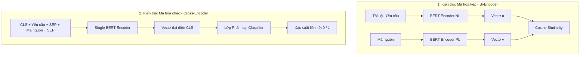

# Mô hình học sâu Transformer và Truy vết dựa trên BERT (BERT Traceability) trong Kỹ nghệ Phần mềm

Tài liệu này trình bày chi tiết về phương pháp áp dụng các mô hình học sâu thuộc họ Transformer, đặc biệt là **BERT (Bidirectional Encoder Representations from Transformers)** và các biến thể chuyên dụng (CodeBERT, GraphCodeBERT), để giải quyết bài toán khôi phục liên kết vết (traceability recovery) trong kỹ nghệ phần mềm.

---

## 1. Lý do chuyển dịch từ IR truyền thống sang BERT

Các phương pháp Truy xuất thông tin (IR) truyền thống (như VSM với TF-IDF) gặp phải rào cản lớn nhất là **"Khoảng cách ngữ nghĩa" (Semantic Gap)**.

* **Lexical Match (So khớp từ vựng):** IR truyền thống chỉ so khớp các ký tự bề mặt. Nếu lập trình viên sử dụng từ đồng nghĩa (ví dụ: yêu cầu dùng từ `"retrieve"`, mã nguồn dùng hàm `fetch()`), IR sẽ không tìm thấy liên kết.
* **Context Blindness (Mù ngữ cảnh):** IR coi tài liệu là một "túi từ" phi cấu trúc (bag of words), làm mất hoàn toàn trật tự từ, cấu trúc ngữ pháp và ngữ cảnh xung quanh từ đó.

**Giải pháp từ BERT:**
BERT sử dụng cơ chế **Self-Attention** (tự chú ý) của kiến trúc Transformer để hiểu mối quan hệ hai chiều giữa các từ trong câu. BERT chuyển đổi các tạo tác phần mềm (văn bản yêu cầu hoặc mã nguồn) thành các **vectơ mật độ (dense embeddings)** trong không gian đa chiều, nơi khoảng cách hình học giữa các vectơ biểu thị sự tương đồng về mặt ngữ nghĩa sâu thay vì chỉ so khớp ký tự thô.

---

## 2. Hai kiến trúc truy vết chính bằng BERT

Trong thực tế nghiên cứu và triển khai, người ta áp dụng hai loại kiến trúc mạng Transformer chính để tính điểm tương đồng vết:

### 2.1. Kiến trúc Mã hóa kép (Bi-Encoder / Siamese-BERT)

* **Cơ chế hoạt động:**
  * Sử dụng hai bộ mã hóa BERT độc lập (hoặc chung trọng số) để xử lý riêng biệt tài liệu yêu cầu ($d_{\text{req}}$) và mã nguồn ($d_{\text{code}}$).
  * Tài liệu đặc tả được mã hóa thành một vectơ duy nhất $\vec{u}$ (thường bằng cách lấy trung bình các vectơ từ hoặc lấy đầu ra của token đặc biệt `[CLS]`).
  * Tương tự, tệp mã nguồn được mã hóa thành một vectơ duy nhất $\vec{v}$.
  * Điểm tương đồng vết được tính nhanh bằng công thức Cosine Similarity giữa hai vectơ:
    $$\text{Sim}(d_{\text{req}}, d_{\text{code}}) = \frac{\vec{u} \cdot \vec{v}}{\|\vec{u}\| \|\vec{v}\|}$$
* **Ưu điểm (Hiệu năng cực cao - Scalability):**
  * Tất cả các file mã nguồn ($M$ file) có thể được chạy qua BERT trước để trích xuất vectơ đặc trưng $\vec{v}$ (pre-computation) và lưu trữ vào các Cơ sở dữ liệu vectơ (Vector Database như Milvus, Pinecone, FAISS).
  * Khi có yêu cầu hoặc tài liệu mới cần truy vết, hệ thống chỉ cần chạy mã hóa yêu cầu đó một lần để có vectơ $\vec{u}$, sau đó thực hiện phép nhân ma trận vectơ cực nhanh. Độ phức tạp tìm kiếm chỉ là $O(N + M)$ phép tính BERT.
* **Nhược điểm:**
  * Độ chính xác thường thấp hơn Cross-Encoder vì mô hình không thực hiện so sánh chéo (cross-attention) từng từ của yêu cầu với từng ký tự của mã nguồn trong giai đoạn mã hóa sâu.

---

### 2.2. Kiến trúc Mã hóa chéo (Cross-Encoder / Single-BERT)

* **Cơ chế hoạt động:**
  * Nối chuỗi văn bản yêu cầu và mã nguồn lại với nhau bằng token phân tách `[SEP]`:
    $$\text{Input} = [\text{CLS}] + \text{Tài liệu Yêu cầu} + [\text{SEP}] + \text{Mã nguồn} + [\text{SEP}]$$
  * Đưa chuỗi hợp nhất này vào duy nhất một mô hình BERT. Cơ chế Self-Attention của Transformer cho phép mỗi từ trong tài liệu yêu cầu tương tác và tính toán trọng số trực tiếp với từng phần tử mã nguồn.
  * Vectơ đầu ra tại token `[CLS]` (mang thông tin hội tụ ngữ nghĩa của cả hai tài liệu) được đưa qua một mạng nơ-ron phân loại tuyến tính (Linear Classifier) và hàm Sigmoid để dự đoán xác suất có liên kết vết ($[0, 1]$).
* **Ưu điểm (Độ chính xác vượt trội):**
  * Đạt điểm F1-score và Mean Average Precision (MAP) rất cao nhờ khả năng so khớp ngữ cảnh chi tiết (token-level cross-attention).
* **Nhược điểm (Tốn kém tài nguyên):**
  * Chi phí tính toán cực kỳ lớn. Với $N$ yêu cầu và $M$ tệp mã nguồn, hệ thống buộc phải ghép cặp và chạy qua mô hình BERT tổng cộng $N \times M$ lần. Không thể tính toán trước vectơ (no pre-computation).
  * Độ phức tạp tính toán là $O(N \times M)$ phép suy luận BERT nặng nề, gây nghẽn cổ chai hiệu năng khi triển khai cho các dự án thực tế có hàng chục ngàn file code.

---

## 3. Các mô hình Bimodal Pre-trained (CodeBERT và GraphCodeBERT)

Mô hình BERT truyền thống chỉ được huấn luyện trên ngôn ngữ tự nhiên. Để tối ưu hóa cho ngành công nghiệp phần mềm, các mô hình học sâu bimodal được phát triển:

### A. CodeBERT (Microsoft Research)

* **Khái niệm:** Được huấn luyện trước (pre-trained) trên tập dữ liệu khổng lồ gồm mã nguồn và tài liệu đi kèm (6 ngôn ngữ lập trình phổ biến: Python, Java, JavaScript, Go, Ruby, C++).
* **Khả năng đặc biệt:** Học được biểu diễn chung (shared vector space) cho cả Ngôn ngữ tự nhiên (NL) và Ngôn ngữ lập trình (PL). Nhờ đó, CodeBERT tự động hiểu được hàm `find()` hay biến `lookup` trong mã nguồn tương ứng với từ khóa `"search"` trong tài liệu yêu cầu mà không cần đặt tên trùng khớp.

### B. GraphCodeBERT

* **Đột phá:** Khác với CodeBERT chỉ coi mã nguồn là chuỗi văn bản thô phẳng (flat sequence), GraphCodeBERT bổ sung thêm thông tin về **Cấu trúc luồng dữ liệu (Data Flow)** của chương trình (mối quan hệ phụ thuộc giữa các biến, cách dữ liệu di chuyển từ biến này sang biến khác).
* **Kết quả:** Mô hình có khả năng hiểu logic hoạt động sâu của mã nguồn hơn, tránh việc bị đánh lừa bởi việc lập trình viên đổi tên biến ngẫu nhiên, giúp khôi phục liên kết vết chính xác hơn.

---

## 4. So sánh tổng quan BERT Traceability và IR truyền thống

| Tiêu chí so sánh | Truy vết dựa trên IR truyền thống (VSM, TF-IDF) | Truy vết dựa trên BERT (CodeBERT, GraphCodeBERT) |
| :--- | :--- | :--- |
| **Độ tương đồng ngữ nghĩa** | So khớp từ khóa bề mặt (Lexical similarity), dễ bỏ sót khi lập trình viên dùng từ đồng nghĩa. | So khớp ngữ nghĩa sâu (Semantic similarity), tự nhận diện từ đồng nghĩa và ngữ cảnh phức tạp. |
| **Yêu cầu tiền xử lý** | Bắt buộc phải thực hiện thủ công rất kỹ (Stemming, loại stop words, tách camelCase). | Hầu như không cần tiền xử lý phức tạp vì BERT tự học ngữ cảnh toàn câu thông qua Tokenizer. |
| **Yêu cầu tài nguyên** | Rất nhẹ, chạy nhanh trên CPU thông thường. | Rất nặng, đòi hỏi tài nguyên GPU để huấn luyện và chạy suy luận. |
| **Dữ liệu huấn luyện** | Hầu như không cần dữ liệu huấn luyện gán nhãn trước (Unsupervised). | Đòi hỏi nhiều dữ liệu gán nhãn (labeled data) để tinh chỉnh (Fine-tune) cho riêng từng dự án cụ thể. |

---

## 5. Thách thức cốt lõi và Giải pháp khắc phục

Khi áp dụng BERT vào các dự án phần mềm thực tế, các nhóm phát triển thường gặp phải 3 thách thức lớn sau:

### Thách thức 1: Giới hạn độ dài đầu vào của BERT (Maximum Input Length)

* **Vấn đề:** Các mô hình BERT chuẩn thường giới hạn độ dài đầu vào tối đa là **512 tokens**. Trong khi đó, các tệp mã nguồn hoặc tài liệu đặc tả thiết kế hệ thống thực tế thường dài hàng ngàn dòng. Nếu cắt cụt văn bản, mô hình sẽ mất thông tin quan trọng.
* **Giải pháp:**
  * Sử dụng các mô hình Transformer hỗ trợ ngữ cảnh dài như **Longformer** hoặc **BigBird**.
  * Chia nhỏ tệp mã nguồn thành các đoạn logic ngắn hơn (ví dụ: tách theo từng hàm/phương thức độc lập) rồi tiến hành truy vết ở mức độ phương thức (method-level traceability).

### Thách thức 2: Thiếu hụt dữ liệu gán nhãn (Labeled Data Sparsity)

* **Vấn đề:** Để đạt độ chính xác cao nhất, mô hình BERT cần được tinh chỉnh (fine-tune) trên tập dữ liệu cụ thể của dự án (các cặp liên kết đúng/sai thực tế). Tuy nhiên, hầu hết dự án thực tế đều không có sẵn các dữ liệu gán nhãn này.
* **Giải pháp:**
  * **Chuyển giao học tập (Transfer Learning):** Huấn luyện mô hình trên các tập dữ liệu mã nguồn mở lớn có sẵn liên kết vết (ví dụ: liên kết commit-issue trên GitHub), sau đó chuyển giao sang dự án đích.
  * **Tăng cường dữ liệu (Data Augmentation):** Sử dụng các mô hình sinh (Generative AI) để tự tạo ra các cặp câu truy vấn giả lập từ mã nguồn.

### Thách thức 3: Điểm nghẽn hiệu năng tính toán

* **Vấn đề:** Kiến trúc Cross-Encoder cho độ chính xác cao nhưng quá chậm ($O(N \times M)$), trong khi Bi-Encoder chạy nhanh nhưng độ chính xác thấp hơn.
* **Giải pháp (Phương pháp lai kép - Hybrid Pipeline):**
  * **Vòng 1 (Lọc nhanh):** Sử dụng kiến trúc Bi-Encoder (hoặc IR truyền thống như TF-IDF/BM25) để quét nhanh qua toàn bộ hệ thống, lọc ra Top 50 ứng viên có điểm số cao nhất.
  * **Vòng 2 (Xếp hạng lại - Re-ranking):** Đưa 50 ứng viên này vào mô hình Cross-Encoder chất lượng cao để xếp hạng lại một cách chi tiết nhất. Phương pháp này cân bằng hoàn hảo giữa tốc độ và độ chính xác.
