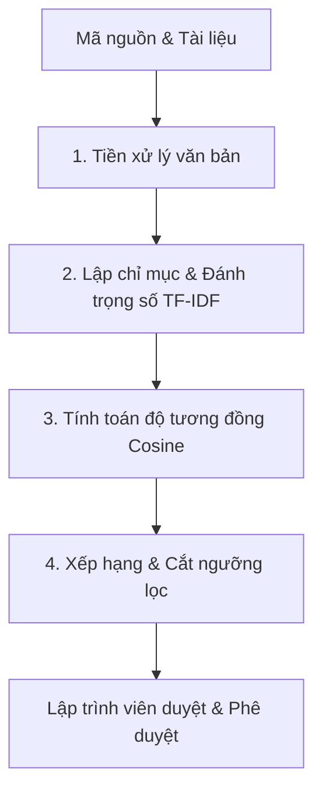
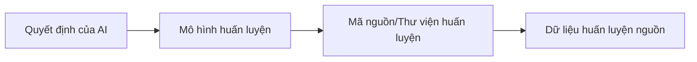

# Tóm tắt Chi tiết: Khôi phục Liên kết Vết (Traceability Recovery) dựa trên Truy vấn Thông tin (Information Retrieval - IR)

Tài liệu này tổng hợp chi tiết nội dung nghiên cứu, quá trình phát triển, các thách thức cốt lõi và định hướng tương lai về khôi phục liên kết vết trong kỹ nghệ phần mềm dựa trên bài báo tổng quan chặng đường 20 năm (2002 - 2022).

---

## 1. Vấn đề cốt lõi và Bước đột phá năm 2002

### Vấn đề thực tế trong Kỹ nghệ Phần mềm

* **Sự bất cân xứng thông tin:** Tài liệu phần mềm (đặc tả yêu cầu, thiết kế, hướng dẫn sử dụng) hầu hết được viết phi chính thức bằng ngôn ngữ tự nhiên. Ngược lại, mã nguồn (source code) mang nặng tính kỹ thuật và cú pháp lập trình.
* **Tầm quan trọng của Liên kết vết (Traceability):** Khả năng liên kết và theo dõi các tạo tác phần mềm khác nhau (từ yêu cầu đặc tả $\rightarrow$ thiết kế $\rightarrow$ mã nguồn $\rightarrow$ ca kiểm thử) là yếu tố sống còn đối với việc hiểu chương trình (program comprehension), bảo trì hệ thống, phân tích tác động thay đổi (impact analysis) và kiểm thử hồi quy (regression testing).
* **Thách thức:** Khi hệ thống phần mềm phát triển ngày càng lớn, phức tạp và phân tán, việc thiết lập và duy trì các mối liên kết vết một cách thủ công là cực kỳ tốn kém và gần như bất khả thi.

### Bước đột phá từ bài báo năm 2002

* **Giải pháp dựa trên Truy vấn Thông tin (IR):** Nhóm tác giả đề xuất phương pháp tự động/bán tự động khôi phục liên kết vết bằng cách sử dụng các mô hình IR để kết nối các tài liệu ngôn ngữ tự nhiên với các danh định trong mã nguồn.
* **Giả thuyết nền tảng:** Lập trình viên thường sử dụng các tên danh định (identifiers) có ý nghĩa thực tế khi đặt tên cho biến, hàm, kiểu dữ liệu, lớp (class) và phương thức.
* **Trực giác cốt lõi:** Mọi tạo tác phần mềm đều chứa thông tin văn bản. Sự tương đồng về văn bản (text similarity) giữa các thành phần khác nhau là một chỉ dấu mạnh mẽ cho mối quan hệ liên kết vết giữa chúng.
* **Tầm quan trọng lịch sử:** Nghiên cứu này đánh dấu sự dịch chuyển từ việc khôi phục từng tạo tác đơn lẻ (như tái dựng biểu đồ UML độc lập của reverse engineering truyền thống) sang việc thiết lập một "mạng lưới quan hệ" (networks of relations) liên kết toàn diện giữa các thực thể phần mềm.

---

## 2. Quy trình hoạt động của Mô hình IR (Pipeline)

Nhóm tác giả định nghĩa một quy trình xử lý bán tự động có cấu trúc dạng đường ống (pipeline), trong đó đầu ra của bước trước là đầu vào của bước sau. Ví dụ tiêu biểu với **Mô hình Không gian Vectơ (Vector Space Model - VSM)**:



### Chi tiết các bước trong quy trình

#### Bước 1: Tiền xử lý (Pre-processing)

Nhằm xây dựng một "túi từ" (bag of words) đặc trưng cho từng tạo tác phần mềm bằng cách loại bỏ nhiễu:

* **Loại bỏ ký tự phi văn bản:** Loại bỏ các toán tử lập trình, ký hiệu đặc biệt và các con số không mang nghĩa.
* **Tách từ ghép (Identifier Splitting):** Phân rã các tên danh định được viết theo quy tắc camelCase (ví dụ: `traceabilityLink` thành `traceability` và `link`) hoặc snake_case.
* **Loại bỏ từ dừng (Stop words removal):** Loại bỏ các từ chức năng phổ biến nhưng không có giá trị phân biệt ngữ nghĩa (như mạo từ, giới từ, trạng từ trong tiếng Anh: "the", "a", "of", "and",...).
* **Chuẩn hóa gốc từ (Stemming):** Cắt tỉa các từ chia/biến thể về dạng gốc của chúng (ví dụ: "retrieving", "retrieved", "retrieval" đều được đưa về gốc "retriev").

#### Bước 2: Lập chỉ mục (Indexing) và Tạo ma trận trọng số

Bước này chuyển đổi các "túi từ" phi cấu trúc thành một mô hình toán học có cấu trúc để máy tính có thể tính toán độ tương đồng ngữ nghĩa.

##### A. Khái niệm và Công thức toán học của TF-IDF

Trọng số của một từ $t$ trong tài liệu $d$ thuộc tập tài liệu $D$ được tính bằng tích của hai thành phần:

$$W(t, d) = TF(t, d) \times IDF(t, D)$$

* **TF (Term Frequency - Tần suất từ):** Trọng số cục bộ (local weight) đo lường tần suất xuất hiện của từ $t$ trong tài liệu $d$. Ý tưởng là từ xuất hiện càng nhiều trong tài liệu thì càng quan trọng đối với tài liệu đó.
  $$\text{TF}(t, d) = \frac{f_{t, d}}{\sum_{t' \in d} f_{t', d}}$$
  *(Trong đó $f_{t, d}$ là số lần từ $t$ xuất hiện trực tiếp trong $d$, mẫu số là tổng số từ của tài liệu $d$ để chuẩn hóa độ dài).*
* **IDF (Inverse Document Frequency - Nghịch đảo tần suất tài liệu):** Trọng số toàn cục (global weight) đo lường mức độ hiếm và đặc trưng của từ $t$ trên toàn bộ kho tài liệu $D$. Ý tưởng là nếu một từ xuất hiện ở hầu hết mọi tài liệu (ví dụ từ "the", "system"), nó không có khả năng phân biệt tài liệu này với tài liệu khác.
  $$\text{IDF}(t, D) = \ln\left(\frac{|D|}{|\{d \in D : t \in d\}|}\right)$$
  *(Trong đó $|D|$ là tổng số tài liệu trong kho dữ liệu, mẫu số là số lượng tài liệu có chứa từ $t$. Thường sử dụng hàm Logarit tự nhiên hoặc Logarit cơ số 10 để làm mịn sự tăng trưởng).*

##### B. Cấu trúc Ma trận Từ - Tài liệu (Term-by-Document Matrix)

Mã nguồn và tài liệu sẽ được ánh xạ vào một không gian đa chiều, nơi mỗi hàng đại diện cho một **Thuật ngữ duy nhất (Term/Vocabulary)** và mỗi cột đại diện cho một **Tài liệu (Document/Source code file)**.

| Thuật ngữ ($t$) | Tài liệu 1 ($d_1$) | Tài liệu 2 ($d_2$) | ... | Tài liệu $N$ ($d_N$) |
| :--- | :---: | :---: | :---: | :---: |
| **Từ_1** | $W(t_1, d_1)$ | $W(t_1, d_2)$ | ... | $W(t_1, d_N)$ |
| **Từ_2** | $W(t_2, d_1)$ | $W(t_2, d_2)$ | ... | $W(t_2, d_N)$ |
| ... | ... | ... | ... | ... |
| **Từ_M** | $W(t_M, d_1)$ | $W(t_M, d_2)$ | ... | $W(t_M, d_N)$ |

##### C. Ví dụ cụ thể minh họa

Giả sử hệ thống phần mềm của chúng ta cực kỳ nhỏ, chỉ gồm **3 tài liệu** ($|D| = 3$) sau khi đã qua bước tiền xử lý (tách từ ghép, xóa stop words):

* **$d_1$ (Yêu cầu đặc tả đăng nhập):** `"user login authenticate password"` (Tổng số từ: 4)
* **$d_2$ (Mã nguồn lớp LoginController.java):** `"login authenticate connection connection"` (Tổng số từ: 4)
* **$d_3$ (Mã nguồn lớp Database.java):** `"database connection query query"` (Tổng số từ: 4)

Kho từ vựng duy nhất gồm **7 thuật ngữ**: `["user", "login", "authenticate", "password", "connection", "database", "query"]`.

Ta tính toán giá trị TF-IDF cho từng từ trong từng tài liệu:

###### 1. Tính toán giá trị IDF cho toàn bộ từ vựng (dùng logarit tự nhiên $\ln$)

* $\text{IDF}(\text{"user"}) = \ln(3 / 1) \approx 1.098$ (chỉ xuất hiện trong $d_1$)
* $\text{IDF}(\text{"login"}) = \ln(3 / 2) \approx 0.405$ (xuất hiện trong $d_1, d_2$)
* $\text{IDF}(\text{"authenticate"}) = \ln(3 / 2) \approx 0.405$ (xuất hiện trong $d_1, d_2$)
* $\text{IDF}(\text{"password"}) = \ln(3 / 1) \approx 1.098$ (chỉ xuất hiện trong $d_1$)
* $\text{IDF}(\text{"connection"}) = \ln(3 / 2) \approx 0.405$ (xuất hiện trong $d_2, d_3$)
* $\text{IDF}(\text{"database"}) = \ln(3 / 1) \approx 1.098$ (chỉ xuất hiện trong $d_3$)
* $\text{IDF}(\text{"query"}) = \ln(3 / 1) \approx 1.098$ (chỉ xuất hiện trong $d_3$)

###### 2. Tính toán TF cho từng tài liệu và nhân với IDF để có trọng số $W(t,d)$

* **Đối với tài liệu $d_1$:**
  * $W(\text{"user"}, d_1) = (1/4) \times 1.098 \approx 0.275$
  * $W(\text{"login"}, d_1) = (1/4) \times 0.405 \approx 0.101$
  * $W(\text{"authenticate"}, d_1) = (1/4) \times 0.405 \approx 0.101$
  * $W(\text{"password"}, d_1) = (1/4) \times 1.098 \approx 0.275$
  * Các từ còn lại không xuất hiện nên trọng số bằng $0$.
* **Đối với tài liệu $d_2$:**
  * $W(\text{"login"}, d_2) = (1/4) \times 0.405 \approx 0.101$
  * $W(\text{"authenticate"}, d_2) = (1/4) \times 0.405 \approx 0.101$
  * $W(\text{"connection"}, d_2) = (2/4) \times 0.405 \approx 0.203$
  * Các từ còn lại bằng $0$.
* **Đối với tài liệu $d_3$:**
  * $W(\text{"database"}, d_3) = (1/4) \times 1.098 \approx 0.275$
  * $W(\text{"connection"}, d_3) = (1/4) \times 0.405 \approx 0.101$
  * $W(\text{"query"}, d_3) = (2/4) \times 1.098 \approx 0.549$
  * Các từ còn lại bằng $0$.

###### Ma trận Từ - Tài liệu kết quả

| Thuật ngữ ($t$) | Đặc tả Đăng nhập ($d_1$) | LoginController ($d_2$) | Database ($d_3$) |
| :--- | :---: | :---: | :---: |
| **user** | **0.275** | 0.000 | 0.000 |
| **login** | **0.101** | **0.101** | 0.000 |
| **authenticate** | **0.101** | **0.101** | 0.000 |
| **password** | **0.275** | 0.000 | 0.000 |
| **connection** | 0.000 | **0.203** | **0.101** |
| **database** | 0.000 | 0.000 | **0.275** |
| **query** | 0.000 | 0.000 | **0.549** |

*Nhận xét:* Dựa vào ma trận này, ta thấy cột vectơ của tài liệu $d_1$ và $d_2$ có chung hai chiều giá trị dương là `login` (đều bằng 0.101) và `authenticate` (đều bằng 0.101). Khi thực hiện tính Cosine góc giữa hai cột này ở Bước 3, điểm tương đồng sẽ cao hơn so với cặp $d_1$ và $d_3$ (vốn không chung chiều dương nào, độ tương đồng bằng 0). Điều này chỉ ra $d_1$ có khả năng liên kết vết với $d_2$.

##### D. Các ngoại lệ và Trường hợp đặc biệt (Edge Cases)

Khi ứng dụng trong thực tế kỹ nghệ phần mềm, TF-IDF gặp một số trường hợp ngoại lệ cần xử lý:

1. **Từ xuất hiện trong mọi tài liệu (IDF = 0):**
   * *Hiện tượng:* Nếu một từ xuất hiện trong tất cả $|D|$ tài liệu (ví dụ từ `"system"`, `"class"` hoặc `"public"` trong mã nguồn Java). Khi đó:
     $$\text{IDF} = \ln\left(\frac{|D|}{|D|}\right) = \ln(1) = 0$$
   * *Hệ quả:* Trọng số của từ này sẽ bị triệt tiêu hoàn toàn về $0$ trong tất cả tài liệu. Đây là một cơ chế tự động rất hữu ích giúp loại bỏ stop words đặc thù của dự án mà bộ lọc stop words chuẩn của ngôn ngữ tự nhiên bỏ sót.
2. **Lỗi chia cho 0 khi tính toán câu truy vấn mới (Zero Division / OOV - Out of Vocabulary):**
   * *Hiện tượng:* Khi lập trình viên gõ một câu truy vấn mới chứa các từ chưa từng xuất hiện trong bất kỳ tài liệu nào của kho dữ liệu ban đầu ($d_f = 0$).
   * *Khắc phục:* Công thức IDF chuẩn sẽ bị lỗi chia cho 0. Do đó, trong thực tế người ta sử dụng công thức làm mịn (smoothing):
     $$\text{IDF}_{\text{smooth}} = \ln\left(\frac{|D|}{1 + |\{d \in D : t \in d\}|}\right) + 1$$
3. **Mã nguồn siêu dài và Đặc tả siêu ngắn:**
   * *Hiện tượng:* Một file mã nguồn quá lớn (chứa hàng ngàn dòng code, nhiều phương thức) sẽ có tổng số từ cực kỳ lớn, làm loãng tần suất tương đối $TF$ của các từ khóa quan trọng. Ngược lại, tài liệu đặc tả rất ngắn sẽ có giá trị $TF$ cao đột biến.
   * *Khắc phục:* Phải áp dụng các thuật toán chuẩn hóa độ dài tài liệu (Length Normalization, ví dụ Cosine Normalization) ở bước so khớp hoặc chuyển sang mô hình cải tiến hơn như **BM25** (mô hình giới hạn sự ảnh hưởng của tần suất từ khi nó vượt ngưỡng bão hòa).

#### Bước 3: Tính toán độ tương đồng (Similarity Computation)

Mục tiêu của bước này là so khớp mức độ liên quan về mặt nội dung giữa tài liệu nguồn (đóng vai trò truy vấn - query) và các thành phần mã nguồn đích.

##### A. Khái niệm và Ý nghĩa hình học của Độ tương đồng Cosine

Khi các tài liệu đã được chuyển đổi thành các vectơ trọng số trong không gian $M$ chiều (với $M$ là kích thước kho từ vựng), ta có thể đo khoảng cách hoặc hướng giữa các vectơ này để xác định độ tương đồng.

Thay vì dùng khoảng cách hình học thông thường (như khoảng cách Euclid - khoảng cách này bị nhiễu do độ dài tài liệu ngắn/dài khác nhau), mô hình IR VSM sử dụng **Độ tương đồng Cosine (Cosine Similarity)**. Cơ chế này đo góc $\theta$ giữa hai vectơ trong không gian đa chiều, bất kể độ dài tuyệt đối của chúng là bao nhiêu.

```text
Không gian thuật ngữ (ví dụ 2 chiều: "login" và "connection")

      Thuật ngữ "connection"
             ^
             |       / v2 (LoginController)
             |      / 
             |     / 
             |    / _ theta
             |   / / \
             |  /  |  \______ v1 (Đặc tả Đăng nhập)
             | /   |
             +----------------------------> Thuật ngữ "login"
```

* **Công thức Toán học:**
  $$\text{Sim}(d_1, d_2) = \cos(\theta) = \frac{\vec{d_1} \cdot \vec{d_2}}{\|\vec{d_1}\| \|\vec{d_2}\|} = \frac{\sum_{i=1}^M W(t_i, d_1) \times W(t_i, d_2)}{\sqrt{\sum_{i=1}^M W(t_i, d_1)^2} \times \sqrt{\sum_{i=1}^M W(t_i, d_2)^2}}$$

  * **Tử số (Tích vô hướng - Dot Product):** Đo lường phần giao nhau về từ vựng giữa hai tài liệu. Nếu hai tài liệu không chia sẻ chung bất kỳ từ khóa nào, tích vô hướng sẽ bằng $0$.
  * **Mẫu số (Tích độ dài Euclid - Norm):** Đóng vai trò chuẩn hóa độ dài của tài liệu. Nó triệt tiêu ưu thế của các tài liệu quá dài (vốn tự động chứa nhiều từ khóa hơn).
* **Miền giá trị:** Vì các trọng số TF-IDF luôn không âm ($\ge 0$), góc $\theta$ giữa hai vectơ nằm trong khoảng $[0^\circ, 90^\circ]$. Do đó, giá trị $\cos(\theta)$ dao động từ $[0, 1]$:
  * **$\text{Sim} = 1$ ($\theta = 0^\circ$):** Hai vectơ cùng hướng hoàn toàn, biểu thị hai tài liệu có tỷ lệ phân bố từ vựng giống hệt nhau.
  * **$\text{Sim} = 0$ ($\theta = 90^\circ$):** Hai vectơ vuông góc, biểu thị hai tài liệu hoàn toàn không chia sẻ từ vựng chung.

##### B. Ví dụ tính toán chi tiết (sử dụng dữ liệu từ Bước 2)

Sử dụng các vectơ trọng số đã tính ở Bước 2:

* Vectơ Đặc tả Đăng nhập: $\vec{d_1} = [0.275, 0.101, 0.101, 0.275, 0.000, 0.000, 0.000]^T$
* Vectơ LoginController: $\vec{d_2} = [0.000, 0.101, 0.101, 0.000, 0.203, 0.000, 0.000]^T$
* Vectơ Database: $\vec{d_3} = [0.000, 0.000, 0.000, 0.000, 0.101, 0.275, 0.549]^T$

Ta tính độ tương đồng giữa đặc tả đăng nhập $d_1$ với hai file mã nguồn $d_2$ và $d_3$:

###### 1. Tính toán độ dài (Norm) của từng vectơ

* $\|\vec{d_1}\| = \sqrt{0.275^2 + 0.101^2 + 0.101^2 + 0.275^2} = \sqrt{0.0756 + 0.0102 + 0.0102 + 0.0756} = \sqrt{0.1716} \approx 0.414$
* $\|\vec{d_2}\| = \sqrt{0.101^2 + 0.101^2 + 0.203^2} = \sqrt{0.0102 + 0.0102 + 0.0412} = \sqrt{0.0616} \approx 0.248$
* $\|\vec{d_3}\| = \sqrt{0.101^2 + 0.275^2 + 0.549^2} = \sqrt{0.0102 + 0.0756 + 0.3014} = \sqrt{0.3872} \approx 0.622$

###### 2. Tính toán độ tương đồng giữa đặc tả đăng nhập $d_1$ và LoginController $d_2$

* Tích vô hướng $\vec{d_1} \cdot \vec{d_2}$:
  $$\vec{d_1} \cdot \vec{d_2} = (0.275 \times 0) + (0.101 \times 0.101) + (0.101 \times 0.101) + (0.275 \times 0) + (0 \times 0.203) + (0 \times 0) + (0 \times 0) = 0.0204$$
* Độ tương đồng Cosine:
  $$\text{Sim}(d_1, d_2) = \frac{0.0204}{0.414 \times 0.248} = \frac{0.0204}{0.1027} \approx \mathbf{0.199}$$

###### 3. Tính toán độ tương đồng giữa đặc tả đăng nhập $d_1$ và Database $d_3$

* Tích vô hướng $\vec{d_1} \cdot \vec{d_3}$:
  $$\vec{d_1} \cdot \vec{d_3} = (0.275 \times 0) + (0.101 \times 0) + (0.101 \times 0) + (0.275 \times 0) + (0 \times 0.101) + (0 \times 0.275) + (0 \times 0.549) = 0$$
* Độ tương đồng Cosine:
  $$\text{Sim}(d_1, d_3) = \frac{0}{0.414 \times 0.622} = \mathbf{0.000}$$

*Kết luận:* Dựa vào thuật toán Cosine, Đặc tả đăng nhập ($d_1$) có độ tương đồng tích cực với lớp `LoginController` ($0.199$) và hoàn toàn không liên quan đến lớp `Database` ($0.000$). Mô hình sẽ xếp hạng mối liên kết $d_1 \leftrightarrow d_2$ cao hơn và gợi ý cho lập trình viên.

##### C. Hạn chế cốt lõi của Độ tương đồng Cosine (Đồng nghĩa và Đa nghĩa)

Mặc dù là công cụ mạnh mẽ, phương pháp so khớp dựa trên Cosine của VSM thuần túy có một nhược điểm nghiêm trọng: **thiếu hiểu biết ngữ nghĩa thực sự**.

* **Bài toán từ đồng nghĩa (Synonymy):** Nếu tài liệu viết `"sign in"` còn mã nguồn đặt tên hàm là `"login"`, mặc dù cùng chỉ một chức năng nhưng do không chia sẻ chung thuật ngữ nào, hai vectơ tương ứng sẽ vuông góc ($\text{Sim} = 0$). Hệ thống sẽ bỏ sót liên kết đúng này (gây giảm Recall).
* **Bài toán từ đa nghĩa (Polysemy):** Từ `"key"` trong tài liệu có thể là "khóa chính" của Database, nhưng trong code lại là "phím nhấn" của bàn phím. VSM đo lường sự tương đồng dựa trên mặt chữ và sẽ hiểu lầm hai tài liệu này giống nhau (gây giảm Precision).
* *Hướng giải quyết:* Đây chính là lý do các nhà khoa học phát triển mô hình **LSI** (Lập chỉ mục ngữ nghĩa ẩn) để chuyển từ không gian từ vựng sang không gian khái niệm rút gọn, hoặc dùng **LDA** để mô hình hóa chủ đề ẩn giúp vượt qua rào cản ngữ nghĩa bề mặt.

#### Bước 4: Xếp hạng (Ranking) và Cắt ngưỡng lọc (Filtering)

* Mô hình tạo ra một danh sách các liên kết vết tiềm năng được xếp hạng từ cao xuống thấp theo điểm tương đồng ngữ nghĩa bề mặt.
* Để kiểm soát số lượng kết quả hiển thị cho nhà phát triển, các nhà nghiên cứu sử dụng nhiều chiến lược cắt ngưỡng lọc:
  * **Ngưỡng cố định (Constant threshold):** Chỉ lấy các liên kết có điểm tương đồng trên một mức quy định sẵn (ví dụ $> 0.5$).
  * **Ngưỡng quy mô (Scale threshold):** Lấy các kết quả đạt tỷ lệ phần trăm nhất định so với điểm tương đồng lớn nhất của lượt tìm kiếm đó.
  * **Điểm cắt cố định (Fixed cut point):** Chỉ lấy đúng $N$ liên kết hàng đầu.
* **Cơ chế bán tự động:** Quy trình này yêu cầu lập trình viên kiểm duyệt thủ công danh sách đã xếp hạng để xác nhận liên kết đúng và loại bỏ liên kết sai (false positives). Hiệu quả được đánh giá thông qua:
  * **Recall (Tỷ lệ bao phủ):** Khả năng tìm thấy bao nhiêu phần trăm liên kết đúng thực tế.
  * **Precision (Độ chính xác):** Tỷ lệ liên kết đúng trên tổng số liên kết được máy gợi ý.

---

## 3. Sự tiến hóa, Ứng dụng & Chiến lược cải tiến

### Sự tiến hóa của các mô hình

Từ các mô hình cơ bản, nhiều kỹ thuật toán học và thống kê phức tạp hơn đã được áp dụng:

* **LSI (Latent Semantic Indexing):** Sử dụng phân tích suy biến để chiếu tài liệu lên một không gian khái niệm có chiều kích thấp hơn, giúp giải quyết tự động bài toán từ đồng nghĩa (synonymy).
* **LDA (Latent Dirichlet Allocation) & RTM (Relational Topic Model):** Các mô hình xác suất giúp trích xuất các chủ đề ngữ nghĩa (topics) ẩn sâu dưới các tầng văn bản.
* **Phân tích số học (B-Splines):** Ánh xạ tần suất xuất hiện của từ lên các đường cong nội suy để tìm quy luật phân bố.

### Mở rộng phạm vi ứng dụng

Công nghệ khôi phục liên kết vết dựa trên IR đã mở rộng ra nhiều hướng:

* **Đa dạng hóa liên kết:** Trác vết giữa yêu cầu cấp cao và yêu cầu cấp thấp, email trao đổi với mã nguồn, ca kiểm thử với mã nguồn, báo cáo lỗi (bug reports) với các git commit tương ứng, và đặc tả dịch vụ với mã nguồn.
* **Mở rộng sang các bài toán Kỹ nghệ Phần mềm khác:**
  * **Feature/Concept Location:** Định vị xem một tính năng viết bằng ngôn ngữ tự nhiên nằm ở đoạn mã nguồn nào.
  * **Bug Localization:** Định vị file code chịu trách nhiệm cho một báo cáo lỗi cụ thể.
  * **API Discussion Mining:** Khai phá thảo luận xung quanh API.
  * **App Store Review Analysis:** Phân tích đánh giá của người dùng trên các chợ ứng dụng phục vụ cho việc lập kế hoạch bảo trì.
  * **Đo lường chất lượng:** Đánh giá độ dễ đọc của mã nguồn, tự động tạo tài liệu tóm tắt mã nguồn (source code summarization), gán nhãn mã nguồn.

### Thách thức lớn nhất: Bất đồng ngôn ngữ (Vocabulary Mismatch)

* Từ vựng trong tài liệu đặc tả (ngôn ngữ tự nhiên) và trong mã nguồn (thuật ngữ kỹ thuật, từ viết tắt lập trình) thường rất khác nhau.
* Do đó, các mô hình IR gặp khó khăn trong việc đẩy toàn bộ các liên kết đúng lên đầu danh sách xếp hạng. Ở nửa dưới của danh sách, các liên kết đúng phân bố cực kỳ thưa thớt trong khi mật độ kết quả sai (false positives) lại quá cao, gây nản lòng và tốn công sức kiểm duyệt cho lập trình viên.

### Các chiến lược cải tiến nâng cao (Enhancement Strategies)

Để giảm thiểu vấn đề bất đồng ngôn ngữ và tăng độ chính xác, các nghiên cứu đã đề xuất:

* **Cải thiện từ vựng:** Chuẩn hóa mã nguồn, mở rộng từ viết tắt, xây dựng các IDE plugin nhắc nhở lập trình viên đồng bộ thuật ngữ với tài liệu đặc tả ngay trong lúc viết code.
* **Gán nhãn từ loại (POS Tagging):** Chỉ lập chỉ mục các danh từ (thường chứa thực thể nghiệp vụ) hoặc lọc kết quả dựa trên sự trùng khớp động từ giữa yêu cầu và mã nguồn.
* **Đánh trọng số nâng cao:** Áp dụng cơ chế *Developers Preferred TF-IDF* nhằm ưu tiên các thực thể mã nguồn có tính bao quát cao (như tên lớp thay vì tên phương thức).
* **Kết hợp đa nguồn tin:** Tích hợp dữ liệu văn bản với thông tin phân tích tĩnh/động mã nguồn (call graphs, runtime traces) và lịch sử git.
* **Vòng lặp phản hồi (Relevance Feedback):** Cho phép hệ thống tự động điều chỉnh ma trận trọng số dựa trên các đánh giá đúng/sai ban đầu của lập trình viên.
* **Quy trình tiệm tiến tối ưu chi phí:** Thiết lập điểm dừng thông minh khi nỗ lực loại bỏ kết quả sai vượt quá lợi ích tìm thêm kết quả đúng (incremental approach).

---

## 4. Tương lai: Kỷ nguyên AI và Vấn đề Mới (AI Traceability)

### Hạn chế của IR truyền thống trước hệ thống hiện đại

* Các hệ thống phần mềm hiện nay (DevOps, Microservices, CI/CD) thay đổi liên tục theo thời gian thực và có quy mô vô cùng khổng lồ.
* Các mô hình IR truyền thống bị giới hạn lớn vì chỉ dừng lại ở mức độ so khớp từ vựng bề mặt chứ không thực sự hiểu ngữ nghĩa sâu (semantics).
* **Cơ hội từ AI/LLMs:** Sự trỗi dậy của các Mô hình Ngôn ngữ Lớn (LLMs) được kỳ vọng sẽ giải quyết triệt để bài toán hiểu ngữ nghĩa sâu sắc và tự động hóa các vòng lặp phản hồi thông qua khả năng tự học tốt hơn.

### VẤN ĐỀ MỚI - Khôi phục liên kết vết cho chính AI (AI Traceability)

Khi các hệ thống AI được tích hợp sâu vào phần mềm, bản thân mô hình học máy đóng vai trò như một "hộp đen". Khái niệm liên kết vết giờ đây dịch chuyển thành **AI Traceability** - khả năng truy vết các quyết định của AI quay ngược lại các thành phần hệ thống và quy trình vòng đời của nó.



Các khía cạnh cốt lõi của AI Traceability bao gồm:

#### 1. Truy xuất nguồn gốc Dữ liệu và Mô hình (Provenance Tracking)

* Cần khả năng truy vết ngược lại xem một quyết định cụ thể của AI bắt nguồn từ tập dữ liệu huấn luyện nào, thuật toán/thư viện huấn luyện nào và phiên bản mô hình nào.
* Điều này đặc biệt quan trọng đối với việc kiểm toán liên tục (continuous auditing), tái lập thử nghiệm (AI reproducibility) và đảm bảo chất lượng chuỗi cung ứng dữ liệu (data supply chain) trong các lĩnh vực nhạy cảm như tài chính, kế toán.

#### 2. Bảo vệ khỏi các cuộc tấn công dữ liệu

* Hệ thống AI dễ bị tổn thương trước các cuộc tấn công "đầu độc dữ liệu" (data poisoning) nhằm thay đổi hành vi mô hình một cách ác ý.
* Khả năng truy xuất nguồn gốc dữ liệu (data provenance) giúp phát hiện, cô lập các mẫu dữ liệu độc hại và khôi phục hệ thống an toàn.

#### 3. Khả năng giải thích được (Explainable AI - XAI)

* Khác với phần mềm truyền thống hoạt động theo các logic rẽ nhánh tất định (deterministic), mô hình AI học máy mang tính xác suất (probabilistic).
* Trí vết liên kết đóng vai trò thiết yếu trong việc giải thích lý do tại sao AI đưa ra một kết quả cụ thể dựa trên dữ liệu đầu vào, từ đó xây dựng lòng tin đối với người dùng và đáp ứng các tiêu chuẩn chứng nhận pháp lý.

#### 4. Đạo đức, Công bằng và Định kiến (Bias & Fairness)

* Nếu dữ liệu huấn luyện chứa các định kiến lịch sử của con người, AI sẽ học và phóng đại những định kiến đó, gây ra phân biệt đối xử (về giới tính, chủng tộc, tuổi tác,...).
* Việc truy vết quyết định của AI đối với các đặc trưng nhạy cảm (ethically sensitive attributes) giúp thực hiện các phân tích công bằng, phát hiện nguồn gốc của định kiến và triển khai các thuật toán giảm thiểu thiên vị (bias mitigation).

---

## Tổng kết

Trải qua hơn 20 năm, kỹ thuật **Truy xuất thông tin (IR)** đã mở đường và định hình phương pháp quản lý liên kết phần mềm. Ngày nay, sự trỗi dậy của **AI và LLMs** hứa hẹn sẽ giải quyết các hạn chế truyền thống về quy mô và ngữ nghĩa. Tuy nhiên, chính AI cũng mở ra một kỷ nguyên thách thức mới: **Liên kết vết không chỉ dừng lại ở tính chính xác kỹ thuật** (mã nguồn nối với tài liệu nào), mà đã trở thành **yếu tố nền tảng cho tính minh bạch, công bằng, đạo đức và khả năng kiểm toán** đối với các quyết định của Trí tuệ nhân tạo trong xã hội.
