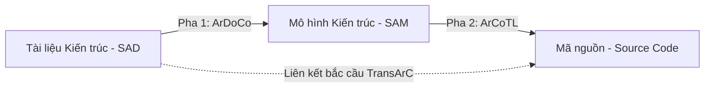

# Phương pháp khôi phục liên kết vết bắc cầu TransArC (Transitive Traceability Recovery)

Tài liệu này trình bày chi tiết về **TransArC** (Transitive links for Architecture and Code) – một phương pháp tiếp cận tiên tiến được công bố tại hội nghị quốc tế về Kỹ nghệ Phần mềm (ICSE 2024) nhằm tự động khôi phục liên kết vết giữa Tài liệu Kiến trúc Phần mềm (SAD) và Mã nguồn (Source Code).

---

## 1. Khái niệm và Lý do ra đời của TransArC

### Vấn đề "Khoảng cách ngữ nghĩa" (Semantic Gap)

Một trong những thách thức lớn nhất trong việc khôi phục liên kết vết (Traceability Link Recovery - TLR) là sự khác biệt sâu sắc về cấp độ trừu tượng giữa:

* **Tài liệu Kiến trúc Phần mềm (Software Architecture Documentation - SAD):** Thường được mô tả phi chính thức bằng ngôn ngữ tự nhiên cấp cao.
* **Mã nguồn (Source Code):** Được viết dưới dạng ngôn ngữ lập trình chính thức cấp thấp.

Các phương pháp tiếp cận trực tiếp (Direct Linking) dựa trên so khớp từ vựng (IR) hoặc học máy thường cho kết quả kém hiệu quả (F1-score thấp) vì hai đối tượng này không chia sẻ nhiều từ vựng và cấu trúc chung.

### Giải pháp bắc cầu (Bridge Strategy) của TransArC

Để giải quyết vấn đề này, TransArC đề xuất không liên kết trực tiếp tài liệu với mã nguồn. Thay vào đó, nó sử dụng **Mô hình kiến trúc phần mềm dạng thành phần (Component-based Software Architecture Models - SAMs)** làm vật trung gian bắc cầu.

* Các mô hình SAM (ví dụ sơ đồ thành phần UML, Palladio Component Model - PCM) đóng vai trò cấu nối lý tưởng: chúng vừa chứa các khái niệm nghiệp vụ (như tên các Component, Interface) có trong tài liệu, vừa ánh xạ trực tiếp đến cấu trúc tổ chức mã nguồn (packages, classes).

---

## 2. Quy trình liên kết vết bắc cầu của TransArC

TransArC thiết lập liên kết vết bắc cầu thông qua quy trình hai pha ghép cặp nối tiếp:

### 2.1. Pha 1: Tài liệu ⟶ Mô hình (Sử dụng ArDoCo)

* **ArDoCo (Architecture Documentation Consistency):** Là một framework được phát triển để phân tích tính nhất quán của tài liệu kiến trúc. Trong TransArC, ArDoCo chịu trách nhiệm kết nối tài liệu chữ (SAD) với mô hình cấu trúc (SAM).
* **Cơ chế hoạt động:**
  * **Phân tích NLP:** Sử dụng các kỹ thuật Xử lý Ngôn ngữ Tự nhiên để gán nhãn từ loại (POS Tagging), chuẩn hóa từ (Lemmatization) và phân tích cú pháp phụ thuộc (Dependency Parsing) cho các văn bản trong SAD.
  * **Trích xuất thực thể:** Nhận diện các từ hoặc cụm từ đại diện cho các thành phần kiến trúc (ví dụ: tên component, tên service).
  * **So khớp Heuristic:** Sử dụng các bộ heuristic ngữ nghĩa để so sánh và ghép cặp các thực thể văn bản này với các phần tử Component/Interface tương ứng trong mô hình SAM.
  * **Kết quả:** Trả về tập hợp các liên kết vết $L_{\text{SAD} \rightarrow \text{SAM}}$ kèm theo điểm số tin cậy.

### 2.2. Pha 2: Mô hình ⟶ Mã nguồn (Sử dụng ArCoTL)

* **ArCoTL (ARchitecture-to-COde Trace Linking):** Là một phương pháp mới được giới thiệu trong TransArC để ánh xạ các cấu trúc mô hình SAM sang các thực thể mã nguồn (classes, packages, methods).
* **Cơ chế hoạt động:**
  * **Biểu diễn trung gian:** Trích xuất các component, sub-components từ mô hình SAM và cấu trúc thư mục, tên package, tên class từ mã nguồn.
  * **Đồ thị tính toán Heuristic (Computational Graph):** Áp dụng một chuỗi các heuristic so khớp tên chuyên sâu, bao gồm:
    * So khớp tiền tố và hậu tố (prefix/suffix matching).
    * Tách từ ghép theo quy tắc camelCase.
    * Đánh giá cấu trúc kế thừa và phân cấp thư mục.
  * **Kết quả:** Trả về tập hợp các liên kết vết $L_{\text{SAM} \rightarrow \text{Code}}$ với độ chính xác thực nghiệm cực kỳ cao (điểm số F1 trung bình đạt tới **0.98**).

### 2.3. Hợp nhất tạo liên kết bắc cầu (Transitive Link Integration)

* TransArC tổng hợp các liên kết từ hai pha trên để tạo ra liên kết trực tiếp từ Tài liệu sang Mã nguồn:
  * Nếu tài liệu $d \in SAD$ liên kết với phần tử mô hình $m \in SAM$ với trọng số $S_{\text{ArDoCo}}(d, m)$, và phần tử $m$ liên kết với file code $c \in Code$ với trọng số $S_{\text{ArCoTL}}(m, c)$.
  * Điểm liên kết bắc cầu cuối cùng $\text{Score}_{\text{TransArC}}(d, c)$ được tính bằng cách lấy giá trị cực đại của tích các trọng số đường đi qua tất cả các phần tử mô hình trung gian:
    $$\text{Score}_{\text{TransArC}}(d, c) = \max_{m \in \text{SAM}} \left( S_{\text{ArDoCo}}(d, m) \times S_{\text{ArCoTL}}(m, c) \right)$$

---

## 3. Hiệu năng thực nghiệm và So sánh

Trong các đánh giá thực nghiệm trên các dự án mã nguồn mở lớn (ví dụ: Teastore, Travel Planner), TransArC đạt hiệu năng vượt trội:

* **Liên kết Mô hình - Mã nguồn (ArCoTL):** Đạt điểm $F_1$-score trung bình **0.98**.
* **Liên kết Tài liệu - Mã nguồn (TransArC):** Đạt điểm $F_1$-score trung bình **0.82**.
* **Đánh giá chung:** Việc sử dụng mô hình trung gian SAM giúp giảm đáng kể lượng kết quả sai lệch (false positives) ở phần đuôi danh sách xếp hạng, giải quyết triệt để điểm yếu cố hữu của các mô hình IR trực tiếp.

---

## 4. Ưu điểm và Hạn chế của TransArC

### 4.1. Ưu điểm

* **Thu hẹp khoảng cách ngữ nghĩa:** Giảm thiểu sự phức tạp khi phải đối chiếu trực tiếp ngôn ngữ tự nhiên cấp cao với mã nguồn lập trình cấp thấp bằng cách chia nhỏ thành hai bài toán đối sánh đơn giản hơn.
* **Độ chính xác cao:** Sự kết hợp giữa xử lý ngôn ngữ của ArDoCo và bộ lọc heuristic cấu trúc của ArCoTL đem lại độ chính xác rất cao mà các mô hình IR truyền thống không thể đạt được.

### 4.2. Hạn chế

* **Lệ thuộc vào Mô hình Kiến trúc (SAM):** Yêu cầu bắt buộc hệ thống phải có sẵn một mô hình kiến trúc dạng thành phần được cập nhật và đồng bộ. Nếu không có mô hình SAM, TransArC không thể vận hành.
* **Chi phí duy trì thủ công:** Việc thiết kế và cập nhật mô hình SAM thường đòi hỏi nhiều thời gian và công sức thủ công từ các kiến trúc sư phần mềm.
* **Hướng giải quyết tương lai:** Các nghiên cứu mới nhất đang hướng tới việc sử dụng LLMs để tự động sinh ra mô hình SAM trung gian từ mã nguồn hoặc tài liệu, từ đó tự động hóa hoàn toàn quy trình bắc cầu của TransArC mà không cần công sức thủ công.
