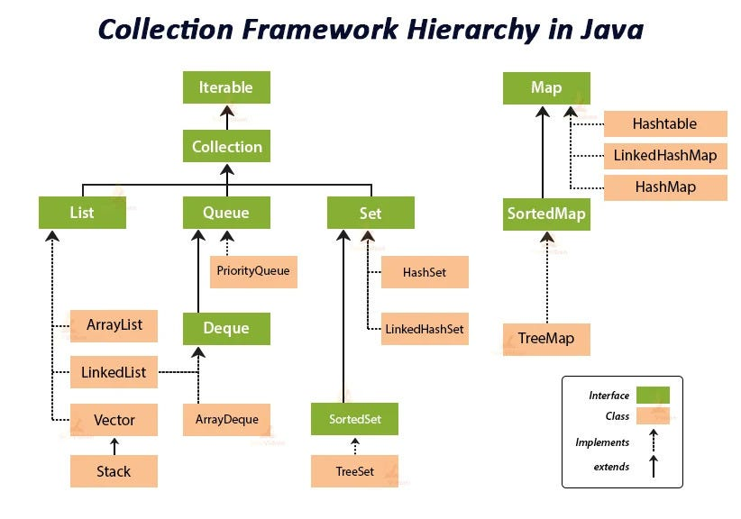

# 6. Collections

### `Iterable<T>` and iteration contract

- **Root of Collections**: Any class implementing `Iterable<T>` can be traversed using an **enhanced for-loop** (`for (T item : iterable)`).
- **Core method**: `Iterator<T> iterator()` returns an iterator (`hasNext()`, `next()`, `remove()`). Under the hood, `for-each` is syntax sugar for an explicit `Iterator` loop.
- **Default methods (Java 8+)**:
  - `forEach(Consumer<? super T> action)`: Functional iteration via lambda/method reference.
  - `spliterator()`: Splittable iterator powering parallel and sequential Stream operations.

### `Collection<E>`: The core data contract

- **Unified contract**: Defines standard operations for single-element groups (`List`, `Set`, `Queue`), regardless of the underlying structure (arrays, linked nodes, hash tables, trees).
- **Core operation groups**:
  - *Query*: `size()`, `isEmpty()`, `contains(Object)`, `containsAll(Collection<?>)`.
  - *Modification*: `add(E)`, `remove(Object)`, `addAll()`, `removeAll()`, `retainAll()` (set intersection), `clear()`.
  - *Array bridge*: `toArray()`, `toArray(T[])`, `toArray(IntFunction<T[]>)` (e.g., `list.toArray(String[]::new)`).
  - *Streams & Functional (Java 8+)*: `stream()`, `parallelStream()`, `removeIf(Predicate)` (safely removes without `ConcurrentModificationException`).
- **Key design nuances**:
  - `contains`/`remove` take `Object` (not `E`) to allow `equals()` comparisons without strict generic subtype constraints.
  - Mutating operations are **optional**: calling them on unmodifiable collections (e.g., `List.of()`) throws `UnsupportedOperationException`.
  - `Map<K, V>` does **not** inherit from `Collection` because it models key-value pairs (2D mapping) rather than single elements (1D group).

### `SequencedCollection<E>`: Ordered collections (Java 21+)

- **Purpose**: Unifies collections with a defined encounter order (`List`, `Deque`, `LinkedHashSet`, `SortedSet`), replacing fragmented endpoint access idioms.
- **Core uniform API**:
  - *First/Last operations*: `getFirst()`, `getLast()`, `addFirst(E)`, `addLast(E)`, `removeFirst()`, `removeLast()`.
  - *Reversed view*: `reversed()` returns a reverse-ordered view in $O(1)$ time without copying.
- **Hierarchy family**:
  - `SequencedCollection<E>` extends `Collection<E>`.
  - `SequencedSet<E>` extends `Set<E>, SequencedCollection<E>` (implemented by `LinkedHashSet`, `TreeSet`).
  - `SequencedMap<K, V>` extends `Map<K, V>` (offers `firstEntry()`, `lastEntry()`, `sequencedKeySet()`, `reversed()`).
- **Interface inheritance**: Interfaces like `Deque<E>` multiple-extend `Queue<E>, SequencedCollection<E>` to aggregate behavioural contracts.

### `Map<K, V>` and `SortedMap<K, V>` contracts

- **Key-Value model**: Maps unique keys to values; intentionally separate from the `Collection` tree.
- **Three collection views**:
  - `keySet()`: `Set<K>` view of keys.
  - `values()`: `Collection<V>` view of values.
  - `entrySet()`: `Set<Map.Entry<K, V>>` of pairs; provides stream helpers like `comparingByKey()` and `comparingByValue()`.
- **Functional utilities (Java 8+)**:
  - `getOrDefault(key, def)` & `putIfAbsent(key, val)`: Safe lookups and conditional writes.
  - `computeIfAbsent(key, fn)`: Idiomatic lazy-init and multi-value grouping.
  - `merge(key, val, fn)`: Elegant frequency counting / value aggregation.
- **`SortedMap<K, V>` and `NavigableMap<K, V>`**:
  - `SortedMap`: Maintains ascending key order by `Comparable` or `Comparator` (`firstKey()`, `lastKey()`, `subMap()`).
  - `NavigableMap` (`TreeMap`): Extends `SortedMap` with closest-match queries (`lowerKey`, `floorKey`, `ceilingKey`, `higherKey`) and bidirectional views (`descendingMap()`).

### Choose by required semantics

| Need | Typical choice | Important property |
| --- | --- | --- |
| Indexed sequence | `ArrayList` | Fast random access and append; middle insert/remove shifts elements |
| Frequent deque operations | `ArrayDeque` | Efficient operations at both ends; preferred over `Stack` |
| Unique values | `HashSet` | Hash-based membership; no iteration-order guarantee |
| Insertion-order set | `LinkedHashSet` | Predictable encounter order |
| Sorted unique values | `TreeSet` | Comparator/natural order; logarithmic core operations |
| Key-value lookup | `HashMap` | Hash-based; no order guarantee |
| Insertion/access order map | `LinkedHashMap` | Useful for predictable order or LRU-style policies |
| Sorted key-value lookup | `TreeMap` | Comparator/natural order |
| FIFO/priority processing | `ArrayDeque` / `PriorityQueue` | Queue order versus heap priority |
| Concurrent lookup/update | `ConcurrentHashMap` | Thread-safe compound operations via methods such as `compute` |

Complexities are expectations for typical implementations, not universal interface promises. A linked list is not automatically faster: traversal and allocation often dominate.

### `HashMap` reasoning

At a high level:

1. compute/spread the key's hash;
2. select a bucket;
3. compare candidate keys using hash and equality;
4. resize when its size crosses an implementation threshold.

Discuss guarantees before internals. Exact bucket structures, capacities, and thresholds are implementation details and can change. Correctness depends on stable `equals`/`hashCode`, not memorizing treeification constants.

### Ordering and comparison

`Comparable<T>` defines a type's natural order. `Comparator<T>` supplies an external order and supports multiple views. A sorted set/map treats comparator equality (`compare(a,b) == 0`) as key equality for its own semantics, so an order inconsistent with `equals` can surprise callers.

### Mutability and views

- `List.of` and `List.copyOf` create unmodifiable lists and reject null elements.
- `Collections.unmodifiableList` is a read-only view; changes through the backing list remain visible.
- `Arrays.asList` is a fixed-size list backed by the array; `set` works, structural add/remove does not.
- Collection views such as `map.keySet()` are often backed by the map.

### Iteration and concurrent modification

Fail-fast behavior detects some invalid structural modifications on a best-effort basis; it is a bug detector, not a synchronization guarantee. Use the iterator's own `remove`, explicit locking, a concurrent collection, or a design that avoids shared mutation.

### Critical Pitfalls & Production Best Practices

- **`ArrayList` vs `LinkedList` (Hardware Reality)**:
  - `ArrayList` dominates in practice due to CPU cache locality (contiguous memory array).
  - `LinkedList` suffers from pointer chasing and per-node allocation overhead. Prefer `ArrayDeque` for stack/queue semantics.
- **Mutable Key Pitfall in `HashMap` / `HashSet`**:
  - Mutating a key after insertion alters its `hashCode()`, routing lookups to the wrong bucket and rendering the entry unreachable (silent memory leak). Always use immutable keys (`String`, `Integer`, `record`).
- **`HashMap` Treeification (Java 8+)**:
  - Colliding buckets transition from linked lists to Red-Black Trees when bucket size $\ge 8$ and map capacity $\ge 64$ ($O(n) \to O(\log n)$ lookup). Shrinks back to a linked list when size drops to $\le 6$.
- **`ArrayDeque` over `Stack`**:
  - `Stack` inherits legacy synchronization overhead from `Vector`. `ArrayDeque` is unsynchronized, circular-array backed, and significantly faster for LIFO/FIFO operations.
- **Specialized High-Performance Collections**:
  - `EnumSet`: Backed by bit vectors (extremely fast bitwise operations).
  - `EnumMap`: Array-indexed internally; zero hash collision overhead.
- **Fail-Fast vs Fail-Safe Iteration**:
  - Standard collections use `modCount` tracking; throw `ConcurrentModificationException` if modified structurally during traversal.
  - Concurrent collections (`ConcurrentHashMap`, `CopyOnWriteArrayList`) provide fail-safe/weakly-consistent iterators operating on internal snapshots.
