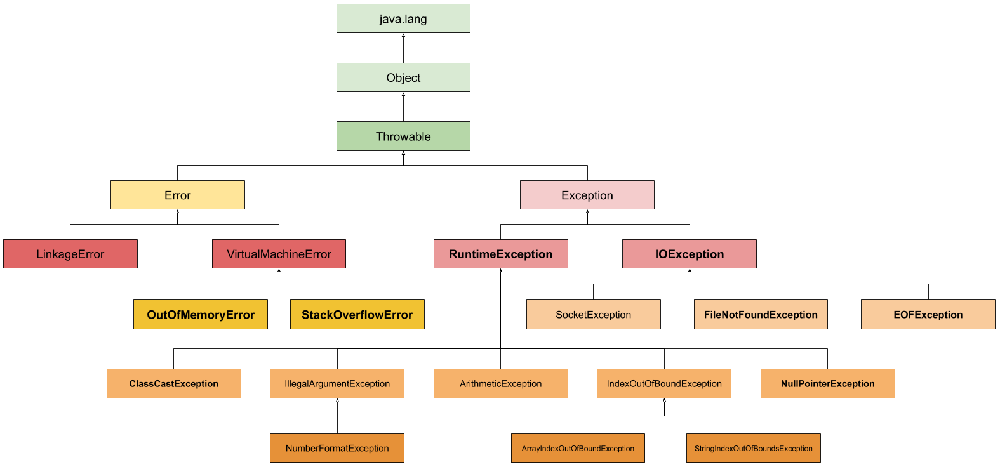

# 7. Exceptions and resource management

### The `Throwable` Hierarchy



- **`Error`**: Fatal JVM-level or infrastructure failures (e.g., `OutOfMemoryError`, `StackOverflowError`, `LinkageError`). Application code must **never** catch `Error` or try to recover from it.
- **Checked Exceptions** (Subclasses of `Exception` excluding `RuntimeException`):
  - Enforced by the compiler (`try-catch` or `throws` declaration required).
  - Designed for recoverable conditions originating outside application control (e.g., missing file, network drop, database timeout).
- **Unchecked Exceptions** (`RuntimeException` and subclasses):
  - Not enforced by compiler.
  - Signal programming bugs, contract violations, or illegal operations (e.g., `NullPointerException`, `IndexOutOfBoundsException`, `IllegalArgumentException`).

---

### Deep Mechanics: How Exceptions Work Under the Hood

#### 1. The Cost of `fillInStackTrace()`
Instantiating an exception is expensive not because of memory allocation, but because the JVM traverses the current thread's call stack to populate `StackTraceElement[]` frames via the native method `Throwable.fillInStackTrace()`. In deep enterprise call stacks (e.g., Spring proxies, filters, interceptors), this stack walk can traverse 50–150+ frames per throw, taking up to 50–200x more CPU cycles.

* **The 4-argument `Throwable` constructor (Java 7+)**:
  ```java
  protected Throwable(String message, Throwable cause, boolean enableSuppression, boolean writableStackTrace)
  ```
  Setting `writableStackTrace = false` instructs the JVM to skip the stack walk entirely (`getStackTrace().length == 0`).

* **Implementation Pattern**:
  ```java
  // Fast exception without stack trace generation (O(1) allocation)
  public class FastValidationException extends RuntimeException {
      public FastValidationException(String msg) {
          // message, cause=null, enableSuppression=false, writableStackTrace=false
          super(msg, null, false, false);
      }

      // Legacy alternative (pre-Java 7):
      // @Override public synchronized Throwable fillInStackTrace() { return this; }
  }
  ```

* **Why most enterprise domain exceptions keep stack traces (`writableStackTrace = true`)**:
  - **Multiple Throw Sites**: If `UserNotFoundException` or `GithubApiException` is thrown across 5 different services (sync, webhooks, export), omitting the stack trace prevents identifying the exact failure site.
  - **APM & Observability**: Tools like Sentry, Datadog, and OpenTelemetry rely on stack traces for automated error grouping and distributed tracing.
  - **Premature Optimization**: A $2–5\,\mu\text{s}$ stack walk is negligible ($<0.01\%$) compared to database queries ($5–20\,\text{ms}$) or external HTTP calls ($50–200\,\text{ms}$).

* **When to disable stack traces (`writableStackTrace = false`)**:
  - High-throughput perimeter guards (Rate limiting, API Gateway auth filters under 50,000+ RPS).
  - Pure reactive / non-blocking control flow (Netty, WebFlux pipelines).
  - Constant/Singleton exceptions (e.g., `public static final FastException INSTANCE = ...`).

#### 2. Exception Chaining (Preserving Root Cause)
When translating low-level infrastructure exceptions (e.g., `SQLException`, `IOException`) to higher-level domain exceptions (e.g., `DataAccessException`), **always pass the original exception as the `cause`**.

* **Why Chaining is Critical**:
  - **Layer Abstraction**: Higher layers (Services/Controllers) should not depend on low-level storage or driver details.
  - **Diagnostic Traceability**: Dropping `cause` destroys the root stack trace, line numbers, and vendor error details (e.g., `SQLIntegrityConstraintViolationException`), making production triage impossible.

* **Internal Mechanism**:
  `Throwable` maintains a singly linked-list reference via `private Throwable cause`. Logging frameworks and `printStackTrace()` recursively traverse `getCause()` to print the full **`Caused by:`** chain.

* **Code Pattern Comparison**:
  ```java
  // ❌ Anti-pattern: Drops root cause; only text remains, stack trace destroyed
  try {
      userDao.save(user);
  } catch (SQLException e) {
      throw new DataAccessException("Cannot save user: " + e.getMessage());
  }

  // ✅ Best Practice: Preserves full diagnostic chain
  try {
      userDao.save(user);
  } catch (SQLException e) {
      throw new DataAccessException("Failed to persist user " + user.getId(), e);
  }
  ```

* **Golden Rule for Custom Exceptions**:
  Always provide constructor overloads that accept `(String message, Throwable cause)` and `(Throwable cause)`.

#### 3. Suppressed Exceptions

- **The Historical Problem (Pre-Java 7 Exception Masking)**:
  In traditional `try-finally` blocks, if the `try` block threw an exception (e.g., `DataCorruptionException`) and the `finally` cleanup block *also* threw an exception (e.g., `IOException` on close), the `finally` exception completely **masked and swallowed** the original business exception.
- **The Java 7 Solution (Automated via Try-With-Resources)**:
  Under `try-with-resources`, the compiler automatically makes the `try` block exception the **Primary Exception** and attaches any exceptions thrown during resource `close()` via `primary.addSuppressed(closeException)`.
- **Stack Trace Visualization**:
  ```text
  java.lang.RuntimeException: Primary business failure in try block
      at Service.process(Service.java:15)
      Suppressed: java.io.IOException: Secondary failure during close()
          at Resource.close(Resource.java:8)
  ```
- **Developer Awareness Rules**:
  1. **Strictly use `try-with-resources`**: Manual `try-finally` cleanup still suffers from legacy exception masking.
  2. **`enableSuppression` flag**: If a custom exception sets `enableSuppression = false` in the `Throwable` constructor, `addSuppressed()` calls are silently ignored.
  3. **Production Triage Strategy**: Focus on the top-level Primary Exception first; `Suppressed:` blocks are secondary fallout from cleanup failure.
  4. **Manual Async/Batch Aggregation**: You can manually call `primary.addSuppressed(subError)` to aggregate failures from multiple parallel operations (e.g., concurrent workers or Java 21 `StructuredTaskScope`) into a single composite throwable.

---

### Resource Management & Try-With-Resources

#### 1. `AutoCloseable` vs `Closeable`
* `AutoCloseable` (Java 7): Defines `void close() throws Exception`.
* `Closeable` (Java 5): Extends `AutoCloseable` and defines `void close() throws IOException` (idempotent contract).

#### 2. Destruction & Close Ordering
Resources declared in `try(...)` are closed in **reverse declaration order** (LIFO):
```java
try (InputStream in = new FileInputStream("in.txt");   // Closed SECOND
     OutputStream out = new FileOutputStream("out.txt")) { // Closed FIRST
    in.transferTo(out);
}
```

#### 3. Effectively Final Resource References (Java 9+)
From Java 9, you can reference already-existing `final` or effectively final resources directly:
```java
BufferedReader reader = Files.newBufferedReader(path);
try (reader) {
    return reader.lines().toList();
}
```

---

### Critical Anti-Patterns & Production Rules

| Anti-Pattern | Bad Practice | Correct Practice |
| :--- | :--- | :--- |
| **Swallowing Exceptions** | `catch (Exception e) {}` | Log with full stack trace, translate, or rethrow. |
| **Catching `Throwable` or `Error`** | `catch (Throwable t)` | Catch specific checked or domain exceptions. Never catch `Error`. |
| **Returning in `finally`** | `finally { return x; }` | **Never** return from `finally`; it swallows any pending exception from `try`. |
| **Log and Rethrow** | `log.error(e); throw e;` | Choose **one**: either handle (log) OR rethrow. Doing both pollutes logs across architectural layers. |
| **Exceptions for Control Flow** | Using `try-catch` instead of `if-else` | Use validation / conditional checks. Exceptions are 100x slower. |
| **Destructive Wrapping** | `throw new AppException(e.getMessage())` | `throw new AppException("Failed to...", e)` (always pass `e`). |

---

### Modern Architectural Patterns

1. **Domain-Specific Hierarchy**: Group business failures under domain runtime exceptions (`NotFoundException`, `DuplicateEntityException`, `ValidationException`).
2. **Global Exception Handlers**: In modern frameworks (Spring `@RestControllerAdvice`, JAX-RS `ExceptionMapper`), catch domain exceptions at boundary adapters to emit RFC 7807 `ProblemDetail` JSON responses uniformly.
3. **Functional Result Pattern**: For non-exceptional business branches, consider returning `Optional<T>` or `Result<T>` instead of throwing expensive exceptions.
