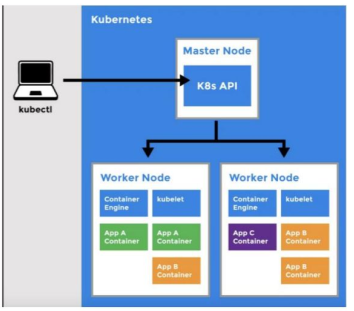
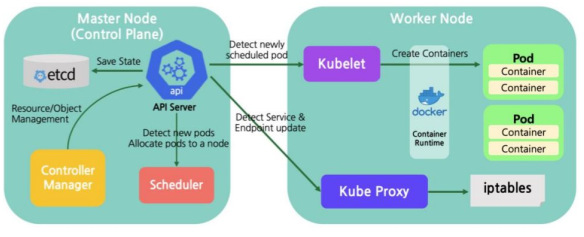

# Kubernetes (K8s)

## What is Kubernetes?

Kubernetes is an open-source container orchestration system used to **automate the deployment, scaling, and management of containerized applications**. It was originally **developed by Google** based on their years of experience running containers at a massive scale (under the internal project name Borg). Today, Kubernetes has a massive, active development community and is maintained by the **CNCF** (Cloud Native Computing Foundation).

## Why Was It Born?

As applications transitioned from monolithic designs to microservices, managing thousands of individual containers manually became impossible. Kubernetes was built to solve this "scale" problem:

* **Managing Large-Scale Operations:** Kubernetes helps organize and monitor thousands of containers without facing issues of resource fragmentation. It acts as the "operating system" for your data center.
* **True Self-Healing:** It automatically detects failed containers or nodes. If a container crashes, K8s kills it and replaces it automatically to maintain the desired state.
* **Advanced Auto-Scaling:** Kubernetes supports auto-scaling, allowing applications to automatically scale up or down based on traffic. It provides features like **Horizontal Pod Autoscaling (HPA)** to handle this dynamically.
* **Resource Optimization:** It efficiently allocates resources (like CPU and memory) between containers and nodes, ensuring you get the most out of your hardware.

---

## How It Works

Kubernetes operates on a distinct client-server architecture consisting of two main parts: the **Control Plane** (Master Nodes) and the **Worker Nodes**.

---

## Control Plane (The Master)

The Control Plane is the "brain" of the cluster. It makes global decisions about the cluster (like scheduling) and detects/responds to cluster events.

* **API Server (`kube-apiserver`):** The central communication hub for all requests; it processes REST commands and interacts with other components. When you use the **`kubectl` CLI**, you are talking directly to this server. It is the only component that communicates directly with `etcd`.
* **etcd:** A highly available, distributed key-value database that **stores all configuration data and the state of Kubernetes**. This is the absolute "source of truth" for your cluster. If `etcd` goes down, your cluster is effectively blind.
* **Scheduler (`kube-scheduler`):** Watches for newly created Pods that have no assigned node, and selects the most appropriate node for them to run on based on resource requirements, hardware constraints, and affinity rules.
* **Controller Manager (`kube-controller-manager`):** Runs controller processes in the background. It continuously monitors the state of resources and ensures that the *actual* state of the cluster is always updated to match the *desired* state you asked for (e.g., ensuring 3 replicas of a web server are always running).

---

## Worker Node

If the Control Plane is the brain, the Worker Nodes are the muscle. These are the physical or virtual servers that do the actual heavy lifting and run your application code.

* **Kubelet:** The primary "captain" or agent running on each node. It ensures that containers are running and healthy inside their Pods. It constantly reports the node's status back to the Control Plane's API Server.
* **Container Runtime:** The underlying software used to actually pull images and run the containers. While Docker was historically the default, modern K8s uses runtimes like **containerd** or **CRI-O** that conform to the Container Runtime Interface (CRI).
* **Kube Proxy:** A network proxy that runs on each node. It maintains network rules (usually via `iptables` or `IPVS`) that allow network communication to your Pods from network sessions inside or outside of your cluster. It essentially provides the load balancing mechanisms for Kubernetes Services.

---

## Core Components (Objects)

To effectively deploy applications, Kubernetes uses a hierarchy of API objects to manage your containers:

* **Pod:** The smallest and most basic deployable unit in K8s. A Pod is a wrapper that encapsulates one or more containers that share storage and networking.
* **ReplicaSet:** Ensures that a specified number of identical Pod replicas are running at any given time.
* **Deployment:** A higher-level abstraction that manages ReplicaSets. It provides declarative updates, allowing you to seamlessly roll out new versions of your application or roll back to older ones without downtime.
* **Service:** A stable networking abstraction that provides a single, persistent IP address (VIP) and DNS name to route traffic to a fluctuating set of Pods.
* **Namespace:** A mechanism to isolate and divide cluster resources between multiple users, teams, or environments (e.g., `dev`, `staging`, `prod`) within a single physical cluster.

