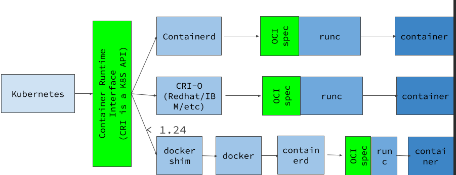
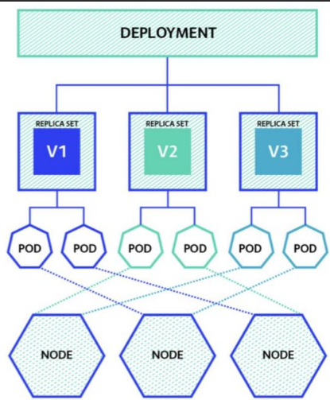

# Kubenetes

## what is kubenetes

Kubernetes is an open-source system used to **automate the deployment, scaling, and management of containerized applications**. It was originally **developed by Google** based on their years of experience running containers at a massive scale. Today, Kubernetes has a large development community and is maintained by the CNCF (Cloud Native Computing Foundation).

## why it born?

- Managing Large-Scale Operations: Kubernetes helps organize and monitor thousands of containers without facing issues of resource fragmentation.
- True Self-Healing: It automatically detects failed containers or nodes and replaces them automatically.
- Advanced Auto-Scaling: Kubernetes supports auto-scaling, allowing applications to automatically scale up or down based on traffic. It provides features like  Horizontal Pod Autoscaling to handle this dynamically.
- Resource Optimization: It efficiently allocates resources (like CPU and memory) between containers and nodes.

## How it works?

Distinct client-server architecture consisting of two main parts: the Control Plane (Master Node) and the Worker Nodes.

## Control plane

The brain of cluster

- API Server: The central point for all requests; it processes commands and interacts with other components of Kubernetes. When you use the **kubectl CLI**, you are talking directly to this server.
- etcd: A distributed database that **stores all configuration data and the state of Kubernetes**. This is the "source of truth" for your cluster.
- Scheduler: Selects the appropriate node to deploy pods based on resource requirements and constraints.
- Controller Manager: Monitors the state of resources and ensures that the actual state is always updated to match the desired state you asked for.

## Worker node

These are the servers that do the actual heavy lifting and run your application code.

- Kubelet: An agent running on each node, ensuring that containers are running and managed properly. It constantly reports back to the Control Plane.
- Container Runtime: The software used to run containers, such as Docker or containerd.
- Kube Proxy: Manages networking between Pods and provides load balancing mechanisms.

## Components

