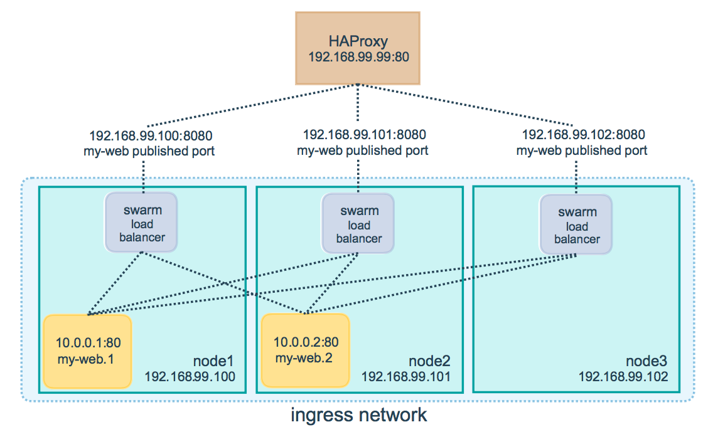

# Docker swarm (docker native container orchestration tool)

- straightforward to install, lightweight, and easy to use.
- automated load balancing within your Docker containers.
- However, it is worth noting that its automation capabilities are **not as robust as those offered by Kubernetes**.

## Why it born?

- The "pain" in DevOps was managing containers at scale.

- when your application needs 50 containers spread across 10 different servers for high availability?

- **Manual Nightmare**: Engineers had to manually SSH into different servers, start containers, manage port conflicts, and stitch them together with external load balancers.

- No Self-Healing: If a server crashed, the containers on it died, and someone (or a custom script) had to manually spin them up elsewhere.

## How it works?

Manager-Worker architecture. (sound likes jenkins)

- Manager Nodes: These are the brains of the cluster. They maintain the cluster state, schedule containers (called "Tasks" in Swarm), and serve the Swarm HTTP API endpoint. Managers constantly monitor the state of the cluster. If a worker node goes down, the manager detects the missing tasks and reschedules them on healthy nodes.

- Worker Nodes: These nodes exist solely to execute the tasks assigned to them by the managers. They run the actual application containers.

- The Routing Mesh: This is one of Swarm's cleverest internal features. It allows any node in the Swarm (even those not running a specific container) to accept incoming traffic for a published port and seamlessly route it to an active container on another node. This built-in layer 4 load balancer makes exposing services to the outside world incredibly easy.

## Setup swarm cluster

```bash

# manager
docker swarm init --advertise-addr <MANAGER_IP_ADDRESS>

# worker
docker swarm join --token <YOUR_SECURE_TOKEN> <MANAGER_IP_ADDRESS>:2377

# create service in manager
docker service create \
  --name demo-web \
  --replicas 3 \    # 3 instances
  -p 8080:80 \      # routing mesh expose 8080
  nginx:alpine

# verify
docker service ps demo-web

# scale
docker service scale demo-web=10

```

## Load Balancing works

There will be a external proxy stay front of swarm.



The Request Lifecycle:

- Step 1: The Client hits a Node IP. The client types your URL or IP address into their browser. That request reaches the physical (or virtual) network interface of any node in your Swarm cluster on the published port (e.g., port 8080). It literally does not matter if the node receiving the request is a Manager, a Worker, or whether it even has your container running on it.

- Step 2: The Ingress Network intercepts.
Before the request can fail (because the container might not be on this specific node), Swarm’s special ingress overlay network intercepts the traffic at the port level.

- Step 3: IPVS makes the load-balancing decision.
Once the ingress network has the request, it hands it over to the Linux kernel's IPVS (IP Virtual Server). This is where Docker Swarm provides automated load balancing within the Docker containers. IPVS looks at the Virtual IP (VIP) of your service, checks its internal table of healthy container replicas, and selects exactly one container to receive the request.

- Step 4: The Overlay Network forwards the traffic.
Now that IPVS has picked a destination container, the traffic is routed seamlessly across the Swarm's internal overlay network to the exact Worker node that is hosting the selected container.

- Step 5: The Container processes and responds.
The target container receives the request, does its computing, and sends the response back through the overlay network, out the node that originally received the request, and back to the client.