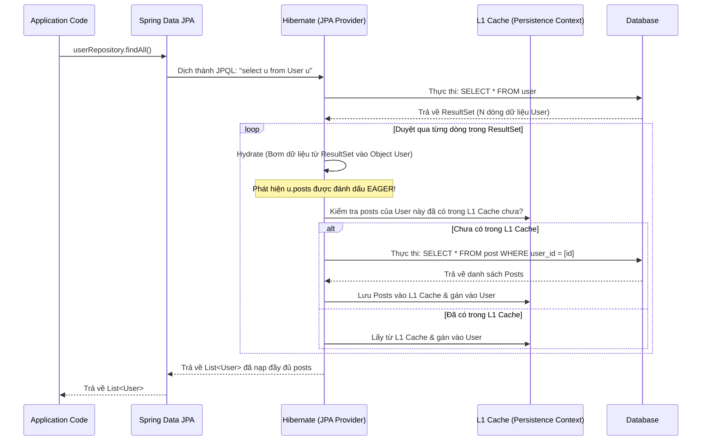

# 🟡 Bài 7: Giải quyết tận gốc vấn đề N+1 Query trong Spring Data JPA & Hibernate

Trong các ứng dụng Spring Boot sử dụng Spring Data JPA (Hibernate), **N+1 Query Problem** là một trong những nguyên nhân hàng đầu gây sụt giảm hiệu năng nghiêm trọng (Performance Bottleneck) khi hệ thống phình to.

---

## 1. Bản chất của vấn đề N+1 Query là gì?

Hiểu đơn giản, vấn đề N+1 xảy ra khi bạn muốn lấy ra danh sách $N$ đối tượng cha từ Database, nhưng để lấy tiếp thông tin liên quan của các đối tượng con, Hibernate lại tự động thực thi thêm $N$ câu lệnh truy vấn riêng lẻ khác.

* **Tổng số câu query:** $1$ (truy vấn lấy danh sách cha) + $N$ (truy vấn lấy con cho từng cha) = $N + 1$ queries.
* **Tác hại:** Nếu $N = 10$, hệ thống chạy vẫn mượt. Nhưng nếu $N = 1000$ hoặc $10.000$, ứng dụng sẽ gửi hàng ngàn request đồng thời tới Database, gây quá tải kết nối, nghẽn mạng (Network Latency), làm chậm API hoặc thậm chí làm sập Database.

---

## 2. Minh họa thực tế & Cơ chế dưới nền (Under the Hood)

Giả sử ta có 2 thực thể: `User` (Cha) và `Post` (Con) với mối quan hệ Một-Nhiều (`@OneToMany`).

```java
@Entity
public class User {
    @Id
    @GeneratedValue
    private Long id;
    private String name;

    @OneToMany(mappedBy = "user", fetch = FetchType.LAZY) // hoặc EAGER
    private List<Post> posts;
}

@Entity
public class Post {
    @Id
    @GeneratedValue
    private Long id;
    private String title;

    @ManyToOne(fetch = FetchType.LAZY)
    @JoinColumn(name = "user_id")
    private User user;
}
```

### Kịch bản 1: Mối quan hệ được cấu hình `FetchType.EAGER`

Khi ta gọi `userRepository.findAll()` để lấy toàn bộ Users:

1. Hibernate chạy 1 query để lấy danh sách Users:

   ```sql
   SELECT * FROM user;
   ```

2. Vì cấu hình là `EAGER` (tải ngay lập tức), Hibernate thấy mỗi User cần phải đi kèm với danh sách `posts`. Do đó, nó tự động duyệt qua $N$ Users vừa lấy được và chạy thêm $N$ câu SELECT độc lập:

   ```sql
   SELECT * FROM post WHERE user_id = 1;
   SELECT * FROM post WHERE user_id = 2;
   ...
   SELECT * FROM post WHERE user_id = N;
   ```

👉 **Hệ quả:** Bạn bị dính ngay lập tức $N+1$ queries ngay khi vừa gọi câu lệnh JPA.

#### 🔍 Bóc tách cơ chế chạy ngầm (Under the Hood) của EAGER

Nhiều lập trình viên thắc mắc: *"Tại sao tôi chỉ gọi đúng một phương thức Java mà Database lại nhận tới N+1 câu lệnh SQL? Ai đã tự động chạy chúng và chạy khi nào?"*

Dưới đây là hành trình chi tiết của luồng đi chạy ngầm dưới nền:



##### 1. Ai thực sự thực thi các câu query này?

* **Spring Data JPA** thực chất chỉ là một lớp giao diện (Repository Interface). Khi ứng dụng khởi chạy, Spring sử dụng kỹ thuật **JDK Dynamic Proxy** để tạo ra một Object đóng thế cho `userRepository` (thực chất bọc class `SimpleJpaRepository`).
* Khi bạn gọi `findAll()`, proxy này gọi tiếp xuống `EntityManager` của JPA.
* `EntityManager` thực chất là một Interface, và trong Spring Boot, **Hibernate** (lớp `SessionImpl`) là thư viện trực tiếp triển khai Interface này. Hibernate mới là "đạo diễn" đứng sau điều khiển JDBC Driver gửi các câu lệnh SQL xuống Database.

##### 2. Quy trình "Bơm dữ liệu" (Hydration) và Trigger EAGER

* **Bước 1 (Parse & Query):** Khi nhận lệnh `findAll()`, Hibernate dịch câu JPQL mặc định thành SQL: `SELECT * FROM user;` rồi gửi xuống DB.
* **Bước 2 (Hydration):** Database trả về một bảng kết quả (`ResultSet`). Hibernate duyệt qua từng dòng để ánh xạ dữ liệu ngược lại thành các Java Object (quá trình này gọi là **Hydration**).
* **Bước 3 (Check Metadata):** Khi dựng đối tượng `User`, Hibernate quét qua file cấu hình Metadata (các annotation `@OneToMany`, `@ManyToOne` được phân tích lúc khởi động ứng dụng). Nó phát hiện thuộc tính `posts` được cấu hình là `FetchType.EAGER`.
* **Bước 4 (Auto-Query Generation):** Theo đặc tả của JPA, `EAGER` bắt buộc: *"Khi thực thể cha được load lên, toàn bộ thực thể con liên quan PHẢI được nạp đầy đủ ngay lập tức."* Do đó, đối với mỗi Object `User` vừa dựng xong, Hibernate kiểm tra trong **First-level Cache (Persistence Context)** xem danh sách `posts` của User đó đã được load trước đó chưa. Nếu chưa, Hibernate lập tức tự động sinh thêm 1 câu lệnh SQL con: `SELECT * FROM post WHERE user_id = ?` và chạy trực tiếp qua kết nối JDBC.

##### 3. Tại sao Hibernate không tự động viết câu lệnh `LEFT JOIN` cho thông minh hơn?

* **Triết lý thiết kế:** Hibernate tôn trọng tuyệt đối câu lệnh JPQL của bạn. Khi bạn viết `select u from User u` (hoặc dùng `findAll()`), bạn đang chỉ định rõ ràng là chỉ lấy dữ liệu từ bảng `User`.
* Nếu Hibernate tự ý chèn thêm `LEFT JOIN` để gom dữ liệu con, nó có thể gây ra **Tích Đề-các (Cartesian Product)** làm nhân bản số lượng dòng trả về dưới DB (ví dụ: 1 user có 100 posts sẽ tạo ra 100 dòng kết quả JOIN). Điều này làm phình to dữ liệu truyền tải qua mạng và gây lãng phí bộ nhớ nếu bạn có nhiều mối quan hệ EAGER khác nhau.
* **Ngoại lệ duy nhất:** Nếu bạn tải một thực thể bằng ID thông qua `entityManager.find(User.class, id)`, Hibernate biết chắc chắn kết quả chỉ có duy nhất 1 dòng, nên nó **sẽ tự động tạo câu lệnh `LEFT JOIN`** để gom toàn bộ dữ liệu EAGER trong 1 câu select duy nhất.

---

### Kịch bản 2: Mối quan hệ được cấu hình `FetchType.LAZY` (Mặc định của @OneToMany)

Nhiều người nghĩ: *"Dùng LAZY loading là giải quyết được N+1!"* 👉 **Sai lầm tai hại.**

Khi ta gọi `userRepository.findAll()`:

1. Hibernate chạy đúng 1 câu query để lấy Users:

   ```sql
   SELECT * FROM user;
   ```

   Lúc này danh sách `posts` bên trong mỗi User chưa được tải từ DB. Thay vào đó, Hibernate sử dụng một đối tượng giả lập gọi là **Hibernate Proxy**.
2. Khi code của bạn duyệt qua danh sách Users để map sang DTO hoặc xử lý logic:

   ```java
   List<UserResponse> responses = users.stream().map(user -> {
       // Gọi user.getPosts() để lấy kích thước hoặc danh sách posts
       return new UserResponse(user.getName(), user.getPosts().size()); 
   }).toList();
   ```

3. Ngay khi hàm `user.getPosts().size()` được gọi, Hibernate buộc phải khởi tạo (initialize) đối tượng Proxy bằng cách chạy câu SELECT xuống DB để lấy danh sách `posts` của User đó.
👉 **Hệ quả:** Quá trình lặp vẫn tạo ra $N$ câu truy vấn con. Lazy loading không giải quyết được N+1, nó chỉ **trì hoãn** thời điểm các câu query con được kích hoạt.

---

## 3. Các giải pháp xử lý tận gốc

### Giải pháp 1: Sử dụng `JOIN FETCH` trong JPQL/HQL (Phổ biến nhất)

`JOIN FETCH` chỉ thị cho Hibernate thực hiện một phép JOIN (INNER JOIN hoặc LEFT JOIN) ngay trong câu truy vấn SQL ban đầu để lấy toàn bộ dữ liệu Cha và Con trong một lần truy cập duy nhất.

* **Repository Code:**

  ```java
  @Query("SELECT u FROM User u LEFT JOIN FETCH u.posts")
  List<User> findAllWithPosts();
  ```

* **SQL được sinh ra dưới DB:**

  ```sql
  SELECT u.id, u.name, p.id, p.title, p.user_id 
  FROM user u 
  LEFT OUTER JOIN post p ON u.id = p.user_id;
  ```

👉 **Kết quả:** Chỉ chạy đúng **1 câu truy vấn duy nhất**!

#### ⚠️ Cạm bẫy cực kỳ nguy hiểm của `JOIN FETCH` cần nhớ

1. **Phân trang trên bộ nhớ RAM (In-Memory Paging):**
   Nếu bạn kết hợp `JOIN FETCH` với `Pageable` để phân trang:

   ```java
   @Query("SELECT u FROM User u LEFT JOIN FETCH u.posts")
   Page<User> findAllWithPosts(Pageable pageable);
   ```

   Do kết quả phép JOIN làm nhân bản số dòng (1 user có 5 posts sẽ tạo ra 5 dòng trong SQL), Hibernate không thể dịch lệnh phân trang thành `LIMIT / OFFSET` dưới Database được. Hibernate sẽ in ra cảnh báo nguy hiểm:
   > `HHH000104: firstResult/maxResults specified with collection fetch; applying in memory!`

   Nó sẽ tải **TOÀN BỘ** dữ liệu từ DB lên RAM rồi mới cắt trang trên Java. Nếu DB có hàng triệu bản ghi, ứng dụng của bạn sẽ bị nghẽn RAM và dính lỗi `OutOfMemoryError`.
2. **Lỗi `MultipleBagFetchException`:**
   Bạn **không được phép** sử dụng `JOIN FETCH` đồng thời cho 2 thực thể con dạng danh sách (`List`) trong cùng 1 query (ví dụ: vừa fetch `posts`, vừa fetch `roles` của User). Hibernate sẽ quăng lỗi vì không thể xử lý tích Đề-các (Cartesian Product) khổng lồ được tạo ra.

---

### Giải pháp 2: Sử dụng `@EntityGraph` (Giải pháp Declarative)

Được giới thiệu từ JPA 2.1, `@EntityGraph` cho phép ta định nghĩa các thuộc tính cần tải sớm (eagerly) một cách tường minh trực tiếp trên các phương thức của Spring Data Repository mà không cần viết lại JPQL.

* **Repository Code:**

  ```java
  @EntityGraph(attributePaths = {"posts"})
  List<User> findAll();
  ```

* **Cách hoạt động:** Hibernate tự động sinh ra câu SQL sử dụng `LEFT JOIN` tương tự như `JOIN FETCH`.
* **Ưu điểm:** Code sạch sẽ, dễ bảo trì, có thể tái sử dụng các phương thức có sẵn của Spring Data JPA.

---

### Giải pháp 3: Cấu hình Batch Fetching (Cứu cánh cho Phân Trang & Multiple Collections)

Thay vì gom tất cả dữ liệu bằng phép JOIN hoặc lấy từng con một cách riêng lẻ, Batch Fetching gom các ID của thực thể cha lại và sử dụng toán tử `IN` để lấy dữ liệu con theo từng lô (Batch).

* **Cấu hình Global trong `application.yml`:**

  ```yaml
  spring:
    jpa:
      properties:
        hibernate:
          default_batch_fetch_size: 20
  ```

* **Hoặc cấu hình riêng biệt trên thuộc tính Entity:**

  ```java
  @OneToMany(mappedBy = "user")
  @BatchSize(size = 20)
  private List<Post> posts;
  ```

* **Cách hoạt động dưới DB:**
  1. Câu query 1 lấy danh sách Users (phân trang bình thường dưới DB):

     ```sql
     SELECT * FROM user LIMIT 10 OFFSET 0;
     ```

  2. Khi bạn lặp qua danh sách để lấy `posts`, thay vì chạy 10 câu select cho 10 users, Hibernate gom các user ID lại và chạy 1 câu duy nhất:

     ```sql
     SELECT * FROM post WHERE user_id IN (1, 2, 3, 4, 5, 6, 7, 8, 9, 10);
     ```

👉 **Kết quả:** Số lượng truy vấn giảm từ $N+1$ xuống còn $1 + N/\text{batchSize}$. Đây là giải pháp tối ưu nhất khi cần **Phân trang (Pagination)** hoặc khi cần fetch nhiều Collection cùng lúc để tránh `MultipleBagFetchException`.

---

### Giải pháp 4: Sử dụng DTO Projection (Tối ưu hóa tuyệt đối cho API Read-Only)

Nếu API của bạn chỉ phục vụ mục đích đọc dữ liệu hiển thị (Read-only) và không cần thực hiện các thao tác ghi/cập nhật thực thể (Write/Update), việc truy vấn nguyên cả Entity rồi map sang DTO là lãng phí và dễ dính lỗi.

Hãy dùng **Constructor Expression** trong JPQL hoặc **Interface Projection** của Spring Data JPA để select đúng các trường cần dùng.

* **DTO Class:**

  ```java
  public record UserPostCountDto(String userName, long postCount) {}
  ```

* **Repository Code:**

  ```java
  @Query("SELECT new com.example.dto.UserPostCountDto(u.name, COUNT(p)) " +
         "FROM User u LEFT JOIN u.posts p GROUP BY u.name")
  List<UserPostCountDto> findUserPostCount();
  ```

👉 **Bản chất:** Câu lệnh SQL chỉ lấy đúng các cột cần thiết, hoàn toàn không có thực thể Proxy nào được tạo ra, loại bỏ hoàn toàn khả năng xảy ra N+1 query.

---

## 4. Cách phát hiện N+1 Query trong quá trình phát triển

1. **Bật Log SQL chi tiết trong môi trường Development (`application.properties`):**

   ```properties
   spring.jpa.show-sql=true
   spring.jpa.properties.hibernate.format_sql=true
   # Log các tham số truyền vào câu lệnh SQL
   logging.level.org.hibernate.orm.queries=trace
   ```

2. **Sử dụng thư viện kiểm thử tự động (QuickPerf):**
   Bạn có thể viết Unit Test kiểm thử số lượng query tối đa được phép thực thi cho một hàm nghiệp vụ. Nếu số lượng query vượt quá cấu hình, test case sẽ thất bại:

   ```java
   @Test
   @ExpectSelect(1) // Bắt buộc chỉ chạy đúng 1 câu SELECT
   void testGetAllUsers() {
       userService.getAllUsers();
   }
   ```

---

## 5. Tự viết JPQL/SQL JOIN: Hibernate có tự động detect để dùng hay không?

Đây là hiểu lầm cực kỳ phổ biến khiến nhiều lập trình viên nghĩ mình đã giải quyết được N+1 bằng cách tự viết câu lệnh `JOIN`, nhưng thực tế hệ thống vẫn chạy ì ạch và dính N+1 query ngầm.

### 5.1 Với JPQL/HQL: Sự khác biệt chí mạng giữa `JOIN` và `JOIN FETCH`

Nếu bạn viết câu lệnh JPQL sử dụng `JOIN` thông thường:

```java
@Query("SELECT u FROM User u LEFT JOIN u.posts p")
List<User> findAllUsersWithJoin();
```

* **Hibernate có tự động nạp danh sách `posts` không?** 👉 **KHÔNG!**
* **Tại sao?**
  * Khi bạn viết `SELECT u`, bạn chỉ định cho Hibernate chỉ lấy dữ liệu của thực thể `User`.
  * Hibernate dịch câu lệnh này thành SQL có `LEFT JOIN` xuống DB để lọc hoặc sắp xếp, nhưng trong phần ánh xạ (mapping), nó **bỏ qua hoàn toàn** dữ liệu của bảng `post` trả về trong ResultSet.
  * Thuộc tính `posts` trong đối tượng `User` Java của bạn vẫn là một Proxy chưa khởi tạo (nếu cấu hình LAZY) hoặc sẽ tiếp tục kích hoạt thêm $N$ câu SELECT độc lập (nếu cấu hình EAGER/hoặc khi bạn gọi `user.getPosts()`).
* **Giải pháp:** Bạn **bắt buộc phải dùng từ khóa `FETCH`** (`LEFT JOIN FETCH u.posts`). Từ khóa `FETCH` là chỉ thị trực tiếp bảo Hibernate: *"Hãy lấy dữ liệu của bảng được JOIN và bơm thẳng vào Collection tương ứng trong thực thể cha!"*

### 5.2 Với Native SQL (`nativeQuery = true`)

Nếu bạn tự viết câu lệnh SQL thuần túy:

```java
@Query(value = "SELECT * FROM user u LEFT JOIN post p ON u.id = p.user_id", nativeQuery = true)
List<User> findAllUsersNative();
```

* **Hibernate có tự động detect và nạp danh sách `posts` không?** 👉 **KHÔNG!**
* **Tại sao?**
  * Khi `nativeQuery = true` và kiểu trả về là `List<User>`, Hibernate chỉ sử dụng các cột của bảng `user` trong ResultSet để map vào thực thể `User`. Các cột của bảng `post` (như `title`, `post_id`) bị vứt bỏ hoàn toàn. Danh sách `posts` trong thực thể `User` vẫn trống rỗng hoặc dính N+1.
* **Cách cấu hình để giải quyết:**
  Để giải quyết vấn đề này khi tự viết SQL Native, bạn có 2 hướng đi chính:

  #### Hướng 1: Map thành DTO (Sử dụng Interface Projection - Khuyên dùng)

  Spring Data JPA hỗ trợ tự động map kết quả của Native SQL JOIN vào một Interface DTO (chỉ cần đặt tên alias trong SQL khớp với tên phương thức getter).

  ```java
  // Định nghĩa Interface DTO
  public interface UserPostProjection {
      String getUserName();
      String getPostTitle();
  }

  // Repository
  @Query(value = "SELECT u.name as userName, p.title as postTitle " +
                 "FROM user u LEFT JOIN post p ON u.id = p.user_id", 
         nativeQuery = true)
  List<UserPostProjection> findUserPosts();
  ```

  *(Spring Boot sẽ tự động tạo một Class Proxy cho Interface này và điền dữ liệu từ SQL vào. Cực kỳ nhanh và không bị N+1).*

  #### Hướng 2: Sử dụng `@SqlResultSetMapping` (Phức tạp, ít dùng)

  Bạn cần chỉ định cấu hình mapping thủ công ở mức thực thể (Entity level) để báo cho Hibernate biết cột nào map vào thực thể nào:

  ```java
  @SqlResultSetMapping(
      name = "UserAndPostMapping",
      entities = {
          @EntityResult(entityClass = User.class),
          @EntityResult(entityClass = Post.class)
      }
  )
  ```

  Sau đó bạn phải gọi thủ công qua `EntityManager` chứ không dùng Spring Data JPA Repository một cách đơn giản được nữa. Do đó, nếu dùng Native SQL, hãy ưu tiên dùng **Interface/DTO Projection**.

---

## 🎯 Bài tập kiểm tra tư duy thực chiến

**Tình huống:** Hệ thống có 3 Entity: `User` -> `Post` -> `Comment` (User có nhiều Posts, mỗi Post có nhiều Comments).
Bạn cần viết API trả về danh sách Users cùng với tất cả Posts và Comments của họ. API này có phân trang.

👉 **Hãy thiết kế giải pháp tối ưu nhất để tránh N+1 query mà không làm tràn RAM (OutOfMemory) và không gây lỗi `MultipleBagFetchException`.**

*(Gợi ý trả lời: Không thể dùng JOIN FETCH cho cả 2 mối quan hệ cùng lúc vì dính MultipleBagFetchException. Không thể dùng JOIN FETCH kết hợp Pageable vì gây In-Memory Paging. Giải pháp tối ưu nhất là dùng phân trang thông thường cho User, kết hợp cấu hình `default_batch_fetch_size: 20` để tải Posts và Comments theo từng lô).*
