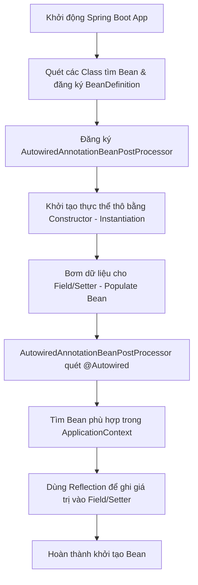
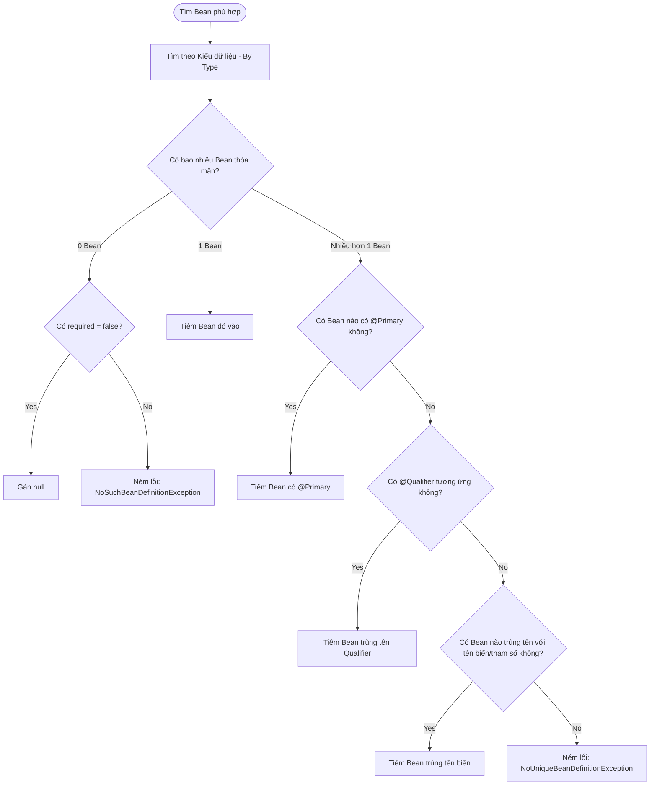

# 🟡 Bài 8: Bóc tách cơ chế hoạt động của `@Autowired` trong Spring Boot 3.*

Hầu hết mọi người đều dùng `@Autowired` để tiêm (inject) các phụ thuộc vào class một cách tự động. Nhưng để làm chủ (Master) Spring, ta cần phải hiểu rõ **bên dưới chạy những gì**, **các Class lõi nào xử lý**, và **thuật toán phân giải Bean** khi xảy ra xung đột.

---

## 1. Bản chất của `@Autowired` là gì?

`@Autowired` là một Annotation do Spring Framework cung cấp để thực hiện **Dependency Injection (DI)**. Thay vì bạn phải tự khởi tạo đối tượng bằng từ khóa `new` hay gọi các hàm getter/setter thủ công, Spring sẽ tự động tìm kiếm Bean phù hợp trong **IoC Container (ApplicationContext)** và tiêm vào cho bạn.

Spring Boot 3.* hỗ trợ 3 hình thức tiêm chính:

1. **Field Injection (Tiêm trực tiếp vào thuộc tính):**

   ```java
   @Autowired
   private PaymentService paymentService;
   ```

   ❌ *Nhược điểm:* Khó viết Unit Test (phải dùng Reflection hoặc Mockito Runner để mock), vi phạm đóng gói (tiêm trực tiếp vào trường `private`), và làm chậm quá trình biên dịch AOT trong Spring Boot 3.
2. **Setter Injection (Tiêm qua hàm setter):**

   ```java
   private PaymentService paymentService;

   @Autowired
   public void setPaymentService(PaymentService paymentService) {
       this.paymentService = paymentService;
   }
   ```

   *Ứng dụng:* Dùng khi phụ thuộc đó là tùy chọn (optional) hoặc có thể thay đổi trong thời gian chạy (runtime).
3. **Constructor Injection (Tiêm qua Constructor - Khuyên dùng tuyệt đối):**

   ```java
   private final PaymentService paymentService;

   // Từ Spring 4.3 trở đi, nếu class chỉ có duy nhất 1 Constructor, 
   // ta không cần viết chữ @Autowired lên đầu nữa, Spring tự ngầm hiểu.
   public UserService(PaymentService paymentService) {
       this.paymentService = paymentService;
   }
   ```

   👉 *Ưu điểm:* Đối tượng được đảm bảo là bất biến (`final`), bắt buộc phải có đủ phụ thuộc mới khởi tạo được (tránh NullPointerException), dễ viết Unit Test (chỉ cần `new UserService(mockService)`), và tương thích hoàn hảo với biên dịch AOT/Native Image của Spring Boot 3.

---

## 2. Dưới nền chạy những gì? (Vòng đời của @Autowired)

Khi Spring Boot 3.* khởi chạy, quá trình xử lý `@Autowired` diễn ra qua các bước chạy ngầm sau:



### Bước 1: Quét Component (Component Scanning)

Spring Boot quét qua package chính (được chỉ định bởi `@SpringBootApplication`) để tìm các class được đánh dấu `@Component`, `@Service`, `@Repository`, `@Configuration`... Spring lưu các thông tin cấu trúc của class này dưới dạng các đối tượng **`BeanDefinition`** (như tên Bean, kiểu Class, các trường có gắn `@Autowired`...).

### Bước 2: Đăng ký Bộ xử lý Autowired

Spring đăng ký một Bean đặc biệt có tên là **`AutowiredAnnotationBeanPostProcessor`** vào IoC Container. Đây là "đạo diễn" cốt lõi chịu trách nhiệm quét, phân tích và thực hiện việc tiêm `@Autowired`.

### Bước 3: Tạo Bean & Hydrate (Instantiation & Population)

Khi Spring khởi tạo một Bean (ví dụ: `UserService`), tiến trình diễn ra trong phương thức `AbstractAutowireCapableBeanFactory.doCreateBean()`:

1. **Instantiation (Tạo thô):** Gọi Constructor để tạo ra instance của Object.
   * *Lưu ý:* Nếu bạn dùng **Constructor Injection**, Spring sẽ giải quyết phụ thuộc ngay tại bước này bằng cách tìm các Bean tham số và truyền vào Constructor để khởi tạo.
2. **Population (Điền dữ liệu):** Gọi phương thức `populateBean()`. Tại đây, Spring gọi đến các `BeanPostProcessor` đã đăng ký ở Bước 2.
3. `AutowiredAnnotationBeanPostProcessor` sẽ dùng Java Reflection để quét các trường (Fields) hoặc phương thức (Methods) có đánh dấu `@Autowired` trong class đó và tiến hành tìm kiếm Bean tương ứng để tiêm vào.

---

## 3. Thuật toán phân giải Bean (Bean Resolution Algorithm)

Khi `AutowiredAnnotationBeanPostProcessor` đi tìm Bean thích hợp để tiêm, nó tuân theo thuật toán nghiêm ngặt sau:



### Chi tiết các bước phân giải

1. **Tìm theo Kiểu dữ liệu (By Type):**
   Nếu bạn khai báo `private PaymentService paymentService;`, Spring sẽ lục trong IoC Container xem có Bean nào kế thừa/triển khai từ `PaymentService` hay không.
2. **Nếu tìm thấy 0 Bean:**
   * Mặc định `@Autowired` yêu cầu phụ thuộc phải tồn tại (`required = true`). Spring sẽ quăng lỗi: **`NoSuchBeanDefinitionException`** và dừng ứng dụng.
   * Nếu cấu hình `@Autowired(required = false)`, Spring sẽ bỏ qua và gán giá trị thuộc tính bằng `null`.
3. **Nếu tìm thấy đúng 1 Bean:**
   * Spring lập tức tiêm Bean đó vào thuộc tính/constructor.
4. **Nếu tìm thấy nhiều hơn 1 Bean (Xung đột phụ thuộc):**
   Giả sử có hai Class `VnPayService` và `MomoService` cùng triển khai interface `PaymentService`. Spring sẽ phân giải theo thứ tự ưu tiên sau:
   * **Độ ưu tiên 1 (`@Primary`):** Kiểm tra xem có Class nào được đánh dấu `@Primary` không. Nếu có, chọn Class đó.
   * **Độ ưu tiên 2 (`@Qualifier`):** Kiểm tra xem tại điểm tiêm có gắn `@Qualifier("beanName")` không. Nếu có, chọn Bean có tên trùng khớp.
   * **Độ ưu tiên 3 (Tên biến - Fallback):** Nếu không có `@Primary` và `@Qualifier`, Spring dùng tên của biến/tham số làm tên Bean để tìm kiếm.
     Ví dụ: `private PaymentService vnPayService;` -> Spring sẽ đi tìm Bean có tên chính xác là `vnPayService`.
   * **Kết quả cuối cùng:** Nếu vẫn không tìm được duy nhất 1 Bean phù hợp, Spring dừng chương trình và báo lỗi: **`NoUniqueBeanDefinitionException`**.

---

## 4. Điểm mới & Sự thay đổi trong Spring Boot 3.*

Spring Boot 3.* chạy trên nền tảng **Spring Framework 6** và yêu cầu tối thiểu **Java 17**. Có hai thay đổi quan trọng liên quan đến cơ chế Dependency Injection:

### 4.1. Chuyển đổi Namespace từ `javax` sang `jakarta`

Trong Spring Boot 3.*, các tiêu chuẩn Java EE cũ được chuyển dịch hoàn toàn sang **Jakarta EE**.

* Nếu trước đây bạn dùng `@Inject` (tiêu chuẩn JSR-330) thuộc gói `javax.inject.Inject`, thì nay bạn phải import từ gói **`jakarta.inject.Inject`**.
* Annotation `@Autowired` chính chủ của Spring vẫn nằm tại gói: `org.springframework.beans.factory.annotation.Autowired`.

### 4.2. Tối ưu hóa AOT (Ahead-of-Time) và Native Image (GraalVM)

Đây là thay đổi lớn nhất của Spring Boot 3.* nhằm hướng tới việc build ứng dụng thành file chạy nhị phân siêu nhẹ, khởi động cực nhanh (Native Image).

* **Vấn đề của Field Injection:** Việc sử dụng `@Autowired` trên Field đòi hỏi JVM phải sử dụng **Reflection** để chọc vào biến private của class lúc runtime để gán giá trị. Điều này gây khó khăn rất lớn cho trình biên dịch AOT của GraalVM vì nó cần phải phân tích tĩnh (Static Analysis) toàn bộ đường đi của ứng dụng từ lúc compile.
* **Xu hướng thiết kế:** Spring Boot 3.* khuyến khích loại bỏ hoàn toàn Field Injection, chuyển sang **Constructor Injection**. Khi compile AOT, Spring có thể dễ dàng khởi tạo Bean bằng code Java thông thường (`new UserService(vnPayService)`) thay vì phải sinh cấu hình Reflection phức tạp.

---

## 5. Tại sao các Service trong Controller/Service khác nên khai báo là `private final`?

Đây là câu hỏi phỏng vấn kinh điển dành cho vị trí Mid-level/Senior Java. Việc khai báo `private final` cho các dependency mang lại 5 lợi ích to lớn sau:

### 5.1. Bắt buộc khởi tạo qua Constructor (Enforce Constructor Injection)

Trong ngôn ngữ Java, một thuộc tính có từ khóa `final` **bắt buộc** phải được gán giá trị ngay khi khai báo hoặc thông qua Constructor của lớp đó trước khi quá trình khởi tạo đối tượng hoàn tất.

* Việc khai báo `private final MyService myService;` ép buộc lập trình viên phải viết Constructor để nạp dependency đó vào.
* Điều này ngăn ngừa hoàn toàn lỗi quên tiêm phụ thuộc (Null Pointer), vì trình biên dịch Java và IDE sẽ lập tức báo lỗi đỏ nếu bạn không khởi tạo thuộc tính `final`.

### 5.2. Đảm bảo tính Bất biến (Immutability)

Khi các dependency được đánh dấu là `final`, tham chiếu của chúng không bao giờ có thể bị gán lại (re-assigned) cho một đối tượng khác sau khi đối tượng cha đã được khởi tạo xong.

* **Ngăn chặn lỗi logic:** Không một dòng code nào trong Controller của bạn có thể vô tình gán đè phụ thuộc (ví dụ: `this.userService = null;` hay gán sang một Service khác lúc runtime).

### 5.3. Đảm bảo An toàn luồng (Thread-Safety) cho Singleton

Mặc định, các Controller và Service trong Spring Boot đều là các **Singleton Bean** (chỉ có duy nhất một thực thể được tạo ra và dùng chung cho toàn bộ ứng dụng).

* Khi hệ thống có hàng ngàn HTTP request gọi vào đồng thời, các Thread (luồng xử lý request) khác nhau sẽ chạy song song trên cùng một instance Controller.
* Nếu thuộc tính không phải là `final` và một Thread nào đó thay đổi giá trị của thuộc tính này, sự thay đổi đó sẽ lập tức ảnh hưởng đến tất cả các Thread khác đang chạy đồng thời, gây ra lỗi cực kỳ nghiêm trọng về dữ liệu (Race Condition).
* `final` đảm bảo trạng thái cấu trúc của Controller là bất biến, giúp nó hoàn toàn an toàn khi xử lý đa luồng.

### 5.4. Hỗ trợ tuyệt đối cho Lombok `@RequiredArgsConstructor`

Khi sử dụng Lombok, bạn chỉ cần đặt `@RequiredArgsConstructor` lên đầu Class:

```java
@RestController
@RequiredArgsConstructor
public class OrderController {
    private final OrderService orderService;
    private final PaymentService paymentService;
}
```

Lombok sẽ quét toàn bộ các thuộc tính được đánh dấu là `final` (hoặc `@NonNull`) để tự động sinh ra một Constructor đầy đủ tham số. Code của bạn sẽ cực kỳ sạch sẽ, ngắn gọn và không có các dòng code Boilerplate thừa thãi.

### 5.5. Dễ dàng viết Unit Test mà không cần khởi động Spring

Khi phụ thuộc được thiết kế qua Constructor và là `final`, bạn có thể viết Unit Test cho Controller một cách cực kỳ nhanh chóng bằng code Java thuần túy mà không cần bật Spring Container (vốn rất tốn thời gian):

```java
OrderService mockService = Mockito.mock(OrderService.class);
// Truyền trực tiếp mock vào Constructor
OrderController controller = new OrderController(mockService); 
```

---

## 🎯 Bài tập kiểm tra tư duy thực chiến

**Tình huống:** Bạn có một Interface `NotificationService` và hai class triển khai:

* Class A: `@Service("emailService") public class EmailNotification implements NotificationService {}`
* Class B: `@Service("smsService") public class SmsNotification implements NotificationService {}`

Trong một Class `OrderController`, bạn viết:

```java
@RestController
public class OrderController {
    @Autowired
    private NotificationService emailService;
}
```

**Câu hỏi:**

1. Code trên có chạy được không? Hay bị lỗi `NoUniqueBeanDefinitionException`?
2. Tại sao? Giải thích chi tiết bước phân giải của Spring.

*(Gợi ý trả lời: Code chạy bình thường. Bước 1 Spring tìm theo Type `NotificationService` thấy 2 Bean. Bước 2 không thấy @Primary hay @Qualifier. Bước 3 Spring fallback về tên biến: tên biến là `emailService` trùng khớp với tên Bean của class `EmailNotification` là `"emailService"`, do đó Spring tự động chọn EmailNotification).*
