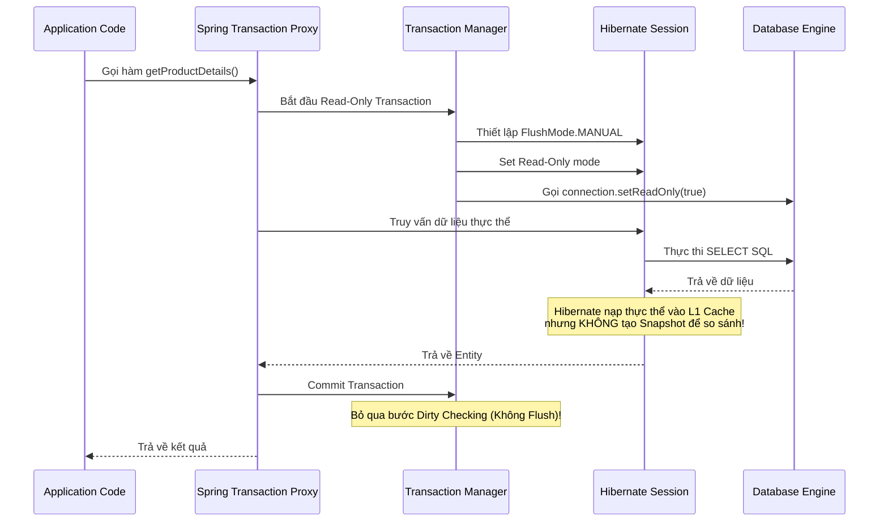

# 🟡 Bài 9: Sức mạnh dưới nền của `@Transactional(readOnly = true)`

Hầu hết lập trình viên chỉ biết `@Transactional` dùng để bọc các thao tác ghi dữ liệu (Create/Update/Delete) để tự động Rollback khi gặp lỗi. Tuy nhiên, việc sử dụng `@Transactional(readOnly = true)` cho các thao tác **chỉ đọc** (Select) lại là một kỹ thuật cực kỳ quan trọng để tối ưu hóa hiệu năng hệ thống ở mức tối đa.

---

## 1. Bản chất của `@Transactional(readOnly = true)` là gì?

Đây là cấu hình đánh dấu cho Spring Framework và Database Engine biết rằng: *"Giao dịch này chỉ thực hiện đọc dữ liệu (SELECT), tuyệt đối không có bất kỳ thao tác chỉnh sửa dữ liệu nào."*

Khi bạn đánh dấu một phương thức là `@Transactional(readOnly = true)`, Spring sẽ can thiệp vào cả **3 tầng kiến trúc**: tầng Hibernate (ORM), tầng JDBC Driver, và tầng Database Engine để thực hiện các tối ưu hóa tương ứng.

---

## 2. Bên dưới chạy những gì? (Under the Hood)

Khi một phương thức được chú giải `@Transactional(readOnly = true)` được gọi, Spring và Hibernate phối hợp xử lý qua các bước sau:



### 2.1. Tối ưu hóa ở tầng Hibernate (ORM Level)

Đây là nơi mang lại hiệu năng cải thiện rõ rệt nhất về mặt CPU và RAM cho ứng dụng Java:

* **Vô hiệu hóa tính năng kiểm tra thay đổi (Dirty Checking):**
  * Ở một giao dịch thông thường (`readOnly = false`), khi bạn nạp một Entity từ DB lên RAM, Hibernate sẽ tạo ra một bản sao lưu (gọi là **Snapshot**) của Entity đó trong vùng nhớ L1 Cache (Persistence Context).
  * Khi giao dịch chuẩn bị Commit, Hibernate buộc phải duyệt qua toàn bộ các Entity đang quản lý để so sánh từng trường dữ liệu với bản Snapshot gốc xem có gì thay đổi không (quá trình này gọi là **Dirty Checking**) để tự động sinh câu lệnh SQL `UPDATE`.
  * Với `readOnly = true`, Hibernate thiết lập **`FlushMode.MANUAL`**. Nó bỏ qua hoàn toàn bước so sánh Dirty Checking này, giúp **tiết kiệm tài nguyên CPU** cực kỳ lớn khi bạn select danh sách hàng ngàn bản ghi.
* **Tiết kiệm RAM bằng việc không tạo Snapshot:**
  * Do không cần kiểm tra thay đổi, Hibernate sẽ **không tạo bản sao Snapshot** cho các Entity được tải lên trong giao dịch Read-Only.
  * Việc này giúp ứng dụng Java **tiết kiệm tới 50% dung lượng bộ nhớ RAM** tiêu thụ cho việc lưu trữ cache của các thực thể trong một transaction.

### 2.2. Tối ưu hóa ở tầng JDBC Driver (Connection Level)

Spring sẽ gọi phương thức **`connection.setReadOnly(true)`** trên đối tượng Connection vật lý của database.

* Tín hiệu này là một chỉ thị để báo cho Database Driver biết kết nối này chỉ phục vụ mục đích đọc dữ liệu.
* Trong kiến trúc cơ sở dữ liệu lớn sử dụng mô hình Cluster Cluster (gồm 1 Database Master để ghi và nhiều Database Slave/Read Replica để đọc), JDBC Driver hoặc các công cụ định tuyến kết nối (như AWS Aurora, Pgpool) sẽ dựa vào cờ `readOnly` này để **tự động định tuyến các câu lệnh SELECT sang các Database Slave**, giúp giảm tải hoàn toàn cho Database Master.

### 2.3. Tối ưu hóa ở tầng Database Engine (DB Level - MySQL, PostgreSQL...)

Khi Database Engine nhận diện được kết nối đang ở trạng thái Read-Only:

* Nó sẽ **loại bỏ các cơ chế khóa dữ liệu (Locks)** không cần thiết (chẳng hạn như không cần tạo các Transaction Locks/Exclusive Locks trên dòng hay bảng được truy vấn).
* DB Engine có thể tối ưu hóa các kế hoạch thực thi (Execution Plans), tăng tốc độ đọc đồng thời (Concurrency) và giảm thiểu khả năng xảy ra lỗi nghẽn khóa (**Deadlock**).

---

## 3. Các kịch bản và Cạm bẫy thực chiến

### Kịch bản 1: Cố tình ghi dữ liệu trong Transaction Read-Only

Điều gì xảy ra nếu trong phương thức `@Transactional(readOnly = true)` bạn cố tình gọi lệnh cập nhật dữ liệu?

```java
@Transactional(readOnly = true)
public void updateProductPrice(Long id, BigDecimal newPrice) {
    Product product = productRepository.findById(id).orElseThrow();
    product.setPrice(newPrice);
    // Hibernate sẽ không tự động Flush!
}
```

* **Kết quả:** Code chạy qua bình thường, **không có lỗi nào xảy ra nhưng dữ liệu dưới DB hoàn toàn không bị thay đổi!**
* **Tại sao?** Vì `FlushMode` được set thành `MANUAL`, Hibernate bỏ qua bước Dirty Checking khi commit nên nó không bao giờ tự động sinh câu lệnh SQL `UPDATE` gửi xuống DB.
* *Lưu ý:* Nếu bạn gọi phương thức ghi rõ ràng (ví dụ: `productRepository.saveAndFlush(product)`), Database sẽ trả về lỗi ngoại lệ: `TransientObjectException` hoặc `SQLException: Connection is read-only`.

### Kịch bản 2: Cạm bẫy tự gọi hàm (Self-Invocation)

Tương tự như lỗi AOP ở Bài 5, nếu một hàm không có transaction gọi một hàm có `@Transactional(readOnly = true)` trong cùng một Class Service, hiệu ứng tối ưu hóa Read-Only sẽ **hoàn toàn biến mất** vì cuộc gọi nội bộ không đi qua lớp Spring Proxy.

---

## 🎯 So sánh hiệu năng thực tế

| Đặc tính | `@Transactional` (Mặc định) | `@Transactional(readOnly = true)` |
| :--- | :--- | :--- |
| **Flush Mode** | `AUTO` (Tự động đồng bộ xuống DB) | `MANUAL` (Chỉ đồng bộ khi gọi thủ công) |
| **Dirty Checking** | Bật (CPU duyệt qua tất cả Entity) | **Tắt (Tiết kiệm CPU)** |
| **Entity Snapshot** | Có (Chiếm RAM để lưu bản sao gốc) | **Không (Tiết kiệm tới 50% RAM)** |
| **JDBC Connection** | `readOnly = false` (Mặc định) | **`readOnly = true` (Cho phép định tuyến Read Replica)** |
| **Database Lock** | Áp dụng đầy đủ các cơ chế khóa | **Bỏ qua khóa đọc, giảm thiểu Deadlock** |

---

## 🎯 Bài tập kiểm tra tư duy thực chiến

**Tình huống:** Bạn đang xây dựng một ứng dụng thương mại điện tử lớn. Bạn thiết kế API xem chi tiết sản phẩm.
Trong tầng Service, bạn viết:

```java
public ProductDetailResponse getProductDetails(Long productId) {
    Product product = productRepository.findById(productId).orElseThrow();
    product.setViewCount(product.getViewCount() + 1); // Tăng lượt xem
    productRepository.save(product);
    return convertToDto(product);
}
```

**Câu hỏi:**

1. Bạn có nên đánh dấu phương thức này là `@Transactional(readOnly = true)` không? Tại sao?
2. Thiết kế trên có điểm gì chưa tối ưu về mặt hiệu năng DB? Hãy đề xuất cách sửa đổi chuẩn Senior.

*(Gợi ý trả lời:

1. Không được dùng `readOnly = true` vì trong hàm có thao tác ghi dữ liệu `save(product)`.
2. Điểm chưa tối ưu: Hàm này bọc cả việc đọc thông tin sản phẩm (nặng) và việc ghi lượt xem (nhẹ nhưng ghi liên tục) vào chung một transaction ghi. Khi lượng truy cập lớn, việc ghi lượt xem liên tục sẽ lock bảng/dòng sản phẩm, làm nghẽn các request đọc khác.
Cách sửa: Tách việc tăng lượt xem ra chạy bất đồng bộ (Asynchronous) hoặc dùng câu lệnh update số lượt xem trực tiếp độc lập (@Modifying @Query), còn hàm lấy thông tin chi tiết sản phẩm thì tách riêng và đánh dấu `@Transactional(readOnly = true)` để tối ưu hóa đọc).*
