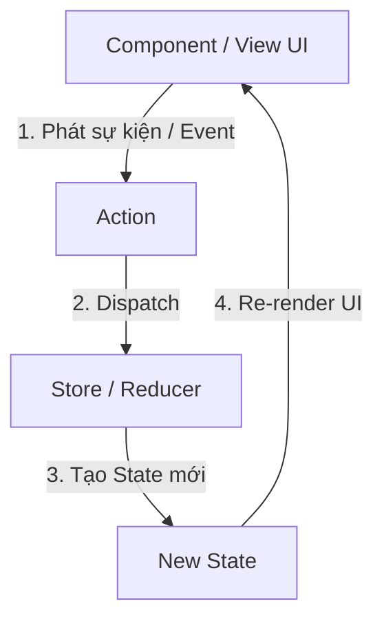

# Hướng dẫn chi tiết về Core Redux (Redux nguyên bản)

Chào mừng bạn đến với thế giới của quản lý trạng thái (State Management) với Redux! Để làm chủ được Redux Toolkit và React Redux, việc hiểu rõ bản chất cốt lõi (Core Redux) là điều bắt buộc.

Tài liệu này sẽ đi qua tất cả các khái niệm cơ bản nhất của Redux từ định nghĩa, nguyên lý hoạt động, luồng dữ liệu cho đến một ví dụ lập trình thực tế bằng JavaScript thuần (Vanilla JS).

---

## 1. Redux là gì? Khi nào cần dùng?

### Redux là gì?

**Redux** là một thư viện mã nguồn mở JavaScript dùng để quản lý trạng thái (state) toàn cục cho ứng dụng. Redux thường được kết hợp với React nhưng nó hoàn toàn độc lập và có thể chạy với Angular, Vue, hoặc JavaScript thuần.

### Vấn đề Redux giải quyết

Trong một ứng dụng React thông thường, dữ liệu được truyền từ trên xuống dưới (parent to child) thông qua `props`.

- Khi ứng dụng phình to, việc truyền props qua quá nhiều tầng trung gian (Prop Drilling) sẽ khiến code cực kỳ khó bảo trì.
- Khi hai component không có quan hệ cha-con muốn chia sẻ state với nhau, việc "nâng state" (lifting state up) lên cha chung gần nhất trở nên phức tạp và rườm rà.

**Redux giải quyết vấn đề này bằng cách đưa toàn bộ state toàn cục của ứng dụng vào một nơi lưu trữ duy nhất gọi là Store.** Mọi component đều có thể trực tiếp lấy dữ liệu từ Store hoặc yêu cầu cập nhật Store mà không cần đi qua trung gian.

```text
Cách truyền thống (Props Drilling):
[Component A] ---> [Component B] ---> [Component C] ---> [Component D] (Nhận props)

Với Redux (Centralized Store):
      [ Centralized Store (State) ]
       /            |            \
      v             v             v
[Component A]  [Component B]  [Component D] (Lấy trực tiếp từ Store)
```

---

## 2. Ba Nguyên Lý Cốt Lõi của Redux

Redux được xây dựng dựa trên 3 nguyên lý nền tảng sau:

### Nguyên lý 1: Single Source of Truth (Một nguồn dữ liệu đáng tin cậy duy nhất)

Toàn bộ state của ứng dụng được lưu trữ trong một cây đối tượng (object tree) nằm bên trong một **Store** duy nhất.

- **Lợi ích**: Dễ dàng debug, lưu lại trạng thái (time-travel debugging), đồng bộ dữ liệu (server-side rendering) và kiểm soát trạng thái ứng dụng.

### Nguyên lý 2: State is Read-only (State là chỉ đọc)

Cách duy nhất để thay đổi state là phát đi một **Action** (một object mô tả sự kiện xảy ra).

- Bạn không được phép chỉnh sửa trực tiếp kiểu: `state.user.name = "John"`.
- Thay vào đó, bạn phải dispatch một action: `dispatch({ type: 'UPDATE_NAME', payload: 'John' })`.
- **Lợi ích**: Đảm bảo không có phần code nào tự ý thay đổi dữ liệu mà không thông qua hệ thống kiểm soát. Mọi thay đổi đều được ghi vết rõ ràng.

### Nguyên lý 3: Changes are made with Pure Functions (Thay đổi thông qua hàm thuần khiết)

Để xác định xem cây state thay đổi thế nào dựa trên action, chúng ta viết các **Reducers**.

- **Reducer** là một *pure function* nhận vào `state` hiện tại và `action`, sau đó trả về một `state` mới hoàn toàn (không được biến đổi trực tiếp state cũ).
- **Hàm thuần khiết (Pure function)**:
  - Luôn trả về cùng một kết quả nếu truyền vào cùng đối số.
  - Không gây ra hiệu ứng phụ (side effects) như gọi API, thay đổi biến toàn cục, v.v.

---

## 3. Kiến Trúc và Luồng Dữ Liệu (Unidirectional Data Flow)

Redux sử dụng mô hình luồng dữ liệu một chiều nghiêm ngặt.



### Chi tiết các thành phần

#### A. Action

Là một Javascript Object đơn giản gửi thông tin từ ứng dụng của bạn tới Store.

- Action BẮT BUỘC phải có trường `type` (kiểu chuỗi) để xác định hành động.
- Action thường có thêm trường `payload` để chứa dữ liệu gửi kèm.

```javascript
// Một action cơ bản
const addTodoAction = {
  type: 'todos/todoAdded',
  payload: 'Học Redux tối nay'
};
```

*Để tái sử dụng, người ta tạo ra các **Action Creator** (hàm trả về một action object):*

```javascript
const addTodo = (text) => {
  return {
    type: 'todos/todoAdded',
    payload: text
  };
};
```

#### B. Reducer

Là một hàm nhận vào `state` cũ và `action` rồi trả về `state` mới: `(state, action) => newState`.

*Quy tắc quan trọng trong Reducer:*

1. KHÔNG được thay đổi trực tiếp đối số `state`. Phải copy state cũ và chỉnh sửa bản copy.
2. KHÔNG được thực hiện các tác vụ bất đồng bộ (API call, setTimeout) hoặc hàm ngẫu nhiên (Math.random(), Date.now()) trong reducer.

```javascript
const initialState = { value: 0 };

function counterReducer(state = initialState, action) {
  switch (action.type) {
    case 'counter/incremented':
      // Tạo một state object mới (bất biến)
      return { ...state, value: state.value + 1 };
    case 'counter/decremented':
      return { ...state, value: state.value - 1 };
    default:
      // Nếu không khớp action nào, trả về state cũ
      return state;
  }
}
```

#### C. Store

Là nơi giữ state của ứng dụng. Store có các nhiệm vụ:

- Cho phép truy cập state hiện tại qua `store.getState()`.
- Cho phép cập nhật state qua `store.dispatch(action)`.
- Đăng ký lắng nghe sự thay đổi qua `store.subscribe(listener)`.

---

## 4. Khái niệm Immutability (Bất biến) trong JavaScript

Để làm việc tốt với Redux, bạn phải hiểu rõ **Immutability**.
Trong JS, các kiểu dữ liệu tham chiếu (Object, Array) rất dễ bị thay đổi ngoài ý muốn:

```javascript
// Mutable (Biến đổi trực tiếp - SAI TRONG REDUX)
const user = { name: 'Nam', age: 20 };
user.age = 21; // Thay đổi trực tiếp thuộc tính của object cũ

// Immutable (Bất biến - ĐÚNG TRONG REDUX)
const user = { name: 'Nam', age: 20 };
const updatedUser = {
  ...user,    // Copy tất cả các thuộc tính của user cũ
  age: 21     // Ghi đè thuộc tính age
};
```

*Nếu bạn sửa trực tiếp state, Redux / React Redux sẽ không nhận diện được sự thay đổi của vùng nhớ (tham chiếu không đổi) và dẫn đến ứng dụng không re-render.*

---

## 5. Ví dụ lập trình hoàn chỉnh với Vanilla Redux

Hãy cùng nhau viết một chương trình đơn giản quản lý bộ đếm (Counter) sử dụng Redux thuần túy để thấy cơ chế hoạt động bên dưới.

### Các bước cài đặt

Nếu bạn có Node.js, bạn có thể tạo một thư mục trống, chạy `npm init -y` và `npm install redux`. Dưới đây là mã nguồn của file chạy bằng Node.js:

```javascript
const { createStore } = require('redux');

// 1. Khởi tạo State ban đầu
const initialState = {
  counter: 0
};

// 2. Định nghĩa Reducer
function counterReducer(state = initialState, action) {
  switch (action.type) {
    case 'INCREMENT':
      return { ...state, counter: state.counter + 1 };
    case 'DECREMENT':
      return { ...state, counter: state.counter - 1 };
    case 'SET_VALUE':
      return { ...state, counter: action.payload };
    default:
      return state;
  }
}

// 3. Tạo Store duy nhất từ Reducer
const store = createStore(counterReducer);

// 4. Lắng nghe thay đổi của Store (Subscribe)
const unsubscribe = store.subscribe(() => {
  console.log('State thay đổi:', store.getState());
});

// 5. Thử nghiệm Dispatch các Actions
console.log('State ban đầu:', store.getState());

store.dispatch({ type: 'INCREMENT' });
// Output: State thay đổi: { counter: 1 }

store.dispatch({ type: 'INCREMENT' });
// Output: State thay đổi: { counter: 2 }

store.dispatch({ type: 'SET_VALUE', payload: 10 });
// Output: State thay đổi: { counter: 10 }

store.dispatch({ type: 'DECREMENT' });
// Output: State thay đổi: { counter: 9 }

// Hủy đăng ký lắng nghe
unsubscribe();

store.dispatch({ type: 'INCREMENT' });
// Sẽ không log nữa vì đã unsubscribe, nhưng state trong store vẫn tăng lên 10.
console.log('State cuối cùng:', store.getState()); // { counter: 10 }
```

---

## 6. Khái niệm Middleware trong Redux

### Middleware là gì?

**Middleware** là một điểm mở rộng nằm giữa lúc **Action được dispatch** và lúc **Action chạm tới Reducer**.

```text
Action -> [ Middleware ] -> Reducer -> Store Update
```

### Tại sao cần Middleware?

Vì Reducer phải là hàm thuần khiết (không bất đồng bộ, không side effects), nên nếu muốn gọi API (Async logic), log dữ liệu, hay xử lý lỗi, ta phải làm điều đó ở Middleware.

- **Redux Thunk** và **Redux Saga** là hai middleware nổi tiếng nhất dùng để xử lý logic bất đồng bộ trong Redux.

---

Bây giờ bạn đã nắm vững nền tảng vững chắc của Core Redux. Trong bài tiếp theo, chúng ta sẽ xem tại sao Redux Toolkit (RTK) ra đời và cách nó loại bỏ hàng tá dòng code boilerplate nhàm chán này.
