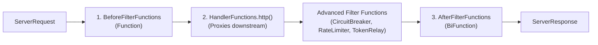

# Spring Cloud Gateway Server MVC - Gateway Handler Filter Functions

> **Overview**: Handler Filter Functions in Spring Cloud Gateway Server MVC intercept HTTP requests and responses passing through the gateway. They allow modifying headers, parameters, body, paths, as well as applying resilience patterns like Circuit Breakers, Rate Limiting, and Load Balancing.

---

## 1. Filter Architecture Categories

Spring Cloud Gateway MVC categorizes filter functions into three main types based on their execution phase:



### 1.1 `BeforeFilterFunctions` (Request Transformation)
* **Functional Signature**: `java.util.Function<ServerRequest, ServerRequest>`
* **Class**: `org.springframework.cloud.gateway.server.mvc.filter.BeforeFilterFunctions`
* **Role**: Runs **before** the request is sent downstream to modify request attributes, headers, parameters, URIs, or paths.
* **Adapter**: Adapted to standard `HandlerFilterFunction` in `FilterFunctions`. Using `BeforeFilterFunctions` static methods is preferred for clarity.

### 1.2 `AfterFilterFunctions` (Response Transformation)
* **Functional Signature**: `java.util.BiFunction<ServerRequest, ServerResponse, ServerResponse>`
* **Class**: `org.springframework.cloud.gateway.server.mvc.filter.AfterFilterFunctions`
* **Role**: Runs **after** the downstream service responds to modify HTTP response status codes, headers, or body content before sending back to the client.
* **Adapter**: Adapted to standard `HandlerFilterFunction` in `FilterFunctions`.

### 1.3 Advanced Filter Functions (Around / Lifecycle Filters)
* **Packages**: `org.springframework.cloud.gateway.server.mvc.filter.*`
* **Role**: Wrap around the request execution lifecycle (`(request, next) -> next.handle(request)`). Used for resilience, rate limiting, circuit breaking, security, and payload body modification.
* **Key Classes**: `CircuitBreakerFilterFunctions`, `Bucket4jFilterFunctions`, `LoadBalancerFilterFunctions`, `RetryFilterFunctions`, `TokenRelayFilterFunctions`, `BodyFilterFunctions`.

---

## 2. Key Built-in Filter Functions Catalog

### 2.1 Request Header & Parameter Manipulation (Before Filters)

| Filter Name | Description | YAML Shortcut | Java DSL (`BeforeFilterFunctions`) |
| :--- | :--- | :--- | :--- |
| **`AddRequestHeader`** | Adds a header to downstream request. | `AddRequestHeader=X-Custom, val` | `addRequestHeader("X-Custom", "val")` |
| **`AddRequestHeadersIfNotPresent`** | Adds headers only if not already present. | `AddRequestHeadersIfNotPresent=X-Custom:val` | `addRequestHeadersIfNotPresent(...)` |
| **`AddRequestParameter`** | Appends query parameter to downstream request. | `AddRequestParameter=param, val` | `addRequestParameter("param", "val")` |
| **`RemoveRequestHeader`** | Removes specified header before forwarding. | `RemoveRequestHeader=X-Secret` | `removeRequestHeader("X-Secret")` |
| **`RemoveRequestParameter`** | Removes query parameter before forwarding. | `RemoveRequestParameter=debug` | `removeRequestParameter("debug")` |
| **`SetRequestHeader`** | Replaces header value on request. | `SetRequestHeader=X-Tenant, t1` | `setRequestHeader("X-Tenant", "t1")` |
| **`SetRequestHostHeader`** | Overrides `Host` header sent downstream. | `SetRequestHostHeader=myhost.com` | `setRequestHostHeader("myhost.com")` |
| **`MapRequestHeader`** | Copies an existing header to a new name. | `MapRequestHeader=From, To` | `mapRequestHeader("From", "To")` |
| **`PreserveHostHeader`** | Sends original client `Host` header to downstream. | `PreserveHostHeader` | `preserveHostHeader()` |

---

### 2.2 Path & URI Modification (Before Filters)

| Filter Name | Description | YAML Shortcut | Java DSL (`BeforeFilterFunctions`) |
| :--- | :--- | :--- | :--- |
| **`StripPrefix`** | Strips `n` path segments from incoming URI. | `StripPrefix=1` | `stripPrefix(1)` |
| **`PrefixPath`** | Prepends a prefix to the request path. | `PrefixPath=/api/v1` | `prefixPath("/api/v1")` |
| **`SetPath`** | Replaces path with a URI template (`/red/{seg}`). | `SetPath=/{segment}` | `setPath("/{segment}")` |
| **`RewritePath`** | RegEx path rewrite (`/foo/(?<seg>.*)` $\rightarrow$ `/${seg}`). | `RewritePath=/foo/(?<s`.*`), /${s}` | `rewritePath("/foo/(?<s`.*`)", "/${s}")` |
| **`StripContextPath`** | Removes context path from request URI. | `StripContextPath=/app` | `stripContextPath("/app")` |
| **`URI` (`uri`)** | Sets the target downstream destination URI. | *(configured as route uri)* | `uri("https://backend.com")` |

---

### 2.3 Response Header & Status Manipulation (After Filters)

| Filter Name | Description | YAML Shortcut | Java DSL (`AfterFilterFunctions`) |
| :--- | :--- | :--- | :--- |
| **`AddResponseHeader`** | Appends header to response returned to client. | `AddResponseHeader=X-Gateway, Spring` | `addResponseHeader("X-Gateway", "Spring")` |
| **`RemoveResponseHeader`** | Strips header from response. | `RemoveResponseHeader=Server` | `removeResponseHeader("Server")` |
| **`SetResponseHeader`** | Replaces header value on response. | `SetResponseHeader=Access-Control-Allow-Origin, *` | `setResponseHeader("Access-Control-Allow-Origin", "*")` |
| **`RewriteResponseHeader`** | Rewrites response header using RegEx. | `RewriteResponseHeader=X-Url, (.*), $1/v2` | `rewriteResponseHeader(...)` |
| **`DedupeResponseHeader`** | Removes duplicate response headers. | `DedupeResponseHeader=Access-Control-Allow-Origin` | `dedupeResponseHeader(...)` |
| **`SetStatus`** | Overrides HTTP status code (e.g. `401`, `404`, `BAD_REQUEST`). | `SetStatus=401` | `setStatus(HttpStatus.UNAUTHORIZED)` |
| **`RedirectTo`** | Sends 302 Redirect to a new URI. | `RedirectTo=302, https://example.com` | `redirectTo(HttpStatus.FOUND, URI.create(...))` |

---

### 2.4 Advanced & Resilience Filters

| Filter Category | Class / Functions | Description | Example Java DSL |
| :--- | :--- | :--- | :--- |
| **Circuit Breaker** | `CircuitBreakerFilterFunctions` | Wraps call with Resilience4j circuit breaker. Fallback URI on failure. | `circuitBreaker("myCB", URI.create("forward:/fallback"))` |
| **Load Balancer** | `LoadBalancerFilterFunctions` | Resolves `lb://service-name` URIs using Spring Cloud LoadBalancer. | `lb("user-service")` |
| **Rate Limiter** | `Bucket4jFilterFunctions` / `RateLimiter` | Limits request rate using Token Bucket algorithm (Bucket4j/Redis). | `rateLimiter(...)` |
| **Token Relay** | `TokenRelayFilterFunctions` | Relays OAuth2 Access Token from `SecurityContext` downstream. | `tokenRelay()` |
| **Retry** | `RetryFilterFunctions` | Automatically retries failed downstream HTTP requests. | `retry(3)` |
| **Modify Body** | `BodyFilterFunctions` | Transforms request/response JSON payload body in-flight. | `modifyRequestBody(...)` / `modifyResponseBody(...)` |

---

## 3. Comprehensive Java Config Example

```java
import org.springframework.context.annotation.Bean;
import org.springframework.context.annotation.Configuration;
import org.springframework.http.HttpStatus;
import org.springframework.web.servlet.function.RouterFunction;
import org.springframework.web.servlet.function.ServerResponse;

import static org.springframework.cloud.gateway.server.mvc.filter.AfterFilterFunctions.addResponseHeader;
import static org.springframework.cloud.gateway.server.mvc.filter.AfterFilterFunctions.setStatus;
import static org.springframework.cloud.gateway.server.mvc.filter.BeforeFilterFunctions.addRequestHeader;
import static org.springframework.cloud.gateway.server.mvc.filter.BeforeFilterFunctions.stripPrefix;
import static org.springframework.cloud.gateway.server.mvc.filter.BeforeFilterFunctions.uri;
import static org.springframework.cloud.gateway.server.mvc.filter.CircuitBreakerFilterFunctions.circuitBreaker;
import static org.springframework.cloud.gateway.server.mvc.filter.TokenRelayFilterFunctions.tokenRelay;
import static org.springframework.cloud.gateway.server.mvc.handler.GatewayRouterFunctions.route;
import static org.springframework.cloud.gateway.server.mvc.handler.HandlerFunctions.http;
import static org.springframework.cloud.gateway.server.mvc.predicate.GatewayRequestPredicates.path;

@Configuration
public class GatewayFilterConfiguration {

    @Bean
    public RouterFunction<ServerResponse> customFilterRoute() {
        return route("order_service_route")
            // Match /api/orders/**
            .route(path("/api/orders/**"), http())
            // 1. BEFORE Filters: Strip '/api' prefix and add custom tracing header
            .before(stripPrefix(1))
            .before(addRequestHeader("X-Gateway-Trace-Id", "trace-998877"))
            .before(uri("http://order-service:8082"))
            // 2. ADVANCED Filters: Token Relay for OAuth2 & Circuit Breaker
            .filter(tokenRelay())
            .filter(circuitBreaker("orderCircuitBreaker", URI.create("forward:/fallback/orders")))
            // 3. AFTER Filters: Add response header
            .after(addResponseHeader("X-Response-Time-Ms", "15"))
            .build();
    }
}
```

---

## 4. `application.yml` Declarative Example

```yaml
spring:
  cloud:
    gateway:
      server:
        webmvc:
          routes:
            - id: user_service_route
              uri: http://user-service:8081
              predicates:
                - Path=/users/**
              filters:
                - StripPrefix=1
                - AddRequestHeader=X-Client-Gateway, SCG-MVC
                - AddResponseHeader=X-Custom-Response, HeaderValue
                - SetStatus=200
```
