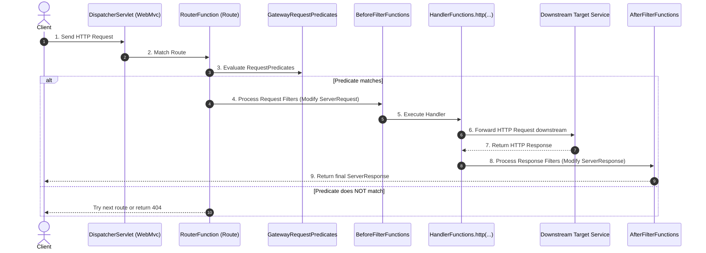

# How Spring Cloud Gateway Server MVC Works

> **Reference Source**: [Spring Cloud Gateway Server WebMVC Documentation](https://docs.spring.io/spring-cloud-gateway/reference/spring-cloud-gateway-server-webmvc/how-it-works.html)

---

## 1. High-Level Architecture Overview

Spring Cloud Gateway Server MVC operates on top of **Spring WebMvc's Functional Endpoints (`WebMvc.fn`)**.

Instead of traditional Spring MVC Controllers (`@Controller` / `@RestController`), Gateway routes are defined as standard `RouterFunction` instances paired with specialized Spring Cloud Gateway components.

### Core Architectural Diagram:

---

## 2. Key Internal Framework Classes & Packages

Spring Cloud Gateway MVC builds on specific internal handler, predicate, and filter provider classes under `org.springframework.cloud.gateway.server.mvc`:

| Category | Fully Qualified Class Name | Description |
| :--- | :--- | :--- |
| **HTTP Forwarding Handlers** | `org.springframework.cloud.gateway.server.mvc.handler.HandlerFunctions` | Provides `HandlerFunction` implementations (e.g., `HandlerFunctions.http(...)`) that forward client requests to downstream URIs over HTTP. |
| **Gateway Predicates** | `org.springframework.cloud.gateway.server.mvc.predicate.GatewayRequestPredicates` | Extends `WebMvc.fn` `RequestPredicate` to provide gateway-specific request matching (e.g., path, host, query params, headers). |
| **Unified Filter Factory** | `org.springframework.cloud.gateway.server.mvc.filter.FilterFunctions` | Main entry point exposing factory methods for all gateway handler filters. |
| **'Before' Request Filters** | `org.springframework.cloud.gateway.server.mvc.filter.BeforeFilterFunctions` | Implements pure request-transformation logic (e.g., `addRequestHeader`, `rewritePath`, `stripPrefix`), adapted in `FilterFunctions` as request processors (`Function<ServerRequest, ServerRequest>`). |
| **'After' Response Filters** | `org.springframework.cloud.gateway.server.mvc.filter.AfterFilterFunctions` | Implements pure response-transformation logic (e.g., `addResponseHeader`, `setStatus`, `dedupeResponseHeader`), adapted in `FilterFunctions` as response processors (`BiFunction<ServerRequest, ServerResponse, ServerResponse>`). |
| **Feature Filters** | Special `*FilterFunctions` classes | Dedicated filter function providers for optional modules (e.g., Circuit Breaker, Load Balancer, Token Relay). |

---

## 3. Step-by-Step Execution Lifecycle

1. **Request Reception**: An HTTP request arrives at Spring MVC's `DispatcherServlet`.
2. **Route Selection**: Spring MVC evaluates active `RouterFunction` beans.
3. **Predicate Matching**: `GatewayRequestPredicates` evaluate the incoming `ServerRequest`.
   * If all predicates match, execution continues on the matching route.
   * If predicates fail, the request proceeds to the next `RouterFunction` or produces a `404 Not Found`.
4. **Pre-Processing ('Before' Filters)**: Filters from `BeforeFilterFunctions` modify the `ServerRequest` (e.g., appending headers, stripping prefixes, rewriting paths).
5. **HTTP Forwarding**: The `HandlerFunction` created via `HandlerFunctions.http(URI)` forwards the transformed `ServerRequest` to the downstream service over HTTP.
6. **Post-Processing ('After' Filters)**: Upon receiving the response from the downstream service, filters from `AfterFilterFunctions` modify the `ServerResponse` (e.g., adding CORS/security headers, changing status codes).
7. **Response Delivery**: The modified `ServerResponse` is sent back to the client.

---

## 4. Critical Rules & Warnings

> [!WARNING]
> **URI Path Ignored Rule**:
> Any path path component defined inside a route URI is **completely ignored** by Spring Cloud Gateway MVC.
>
> * **Incorrect**: `http://backend-service:8080/api/v1` (The `/api/v1` path on the destination URI will be ignored).
> * **Correct Approach**: Set destination URI as `http://backend-service:8080` and use filters like `prefixPath("/api/v1")`, `stripPrefix(1)`, `setPath(...)`, or `rewritePath(...)` to manipulate request paths explicitly.
