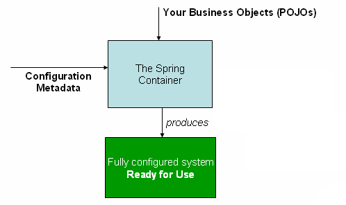

# Container Overview

The `org.springframework.context.ApplicationContext` interface represents the Spring IoC container. It is the heart of any Spring application, responsible for instantiating, configuring, and assembling the objects (known as beans) that make up your application.

The container gets its instructions on the components to instantiate, configure, and assemble by reading **configuration metadata**. With this metadata, you compose your application and define the rich interdependencies between those components.

### Formats for Configuration Metadata
The configuration metadata can be represented in several ways:
*   **Annotated component classes:** Using stereotypes like `@Component`, `@Service`, and `@Repository`.
*   **Configuration classes:** Using Java config with `@Configuration` and factory methods annotated with `@Bean`.
*   **External files:** XML configuration files or Groovy scripts (more common in legacy Spring applications).

---

## Implementations & Bootstrapping

Several implementations of the `ApplicationContext` interface are part of core Spring. 

### Stand-alone Applications
In stand-alone applications, you typically instantiate the container explicitly. Common implementations include:
*   `AnnotationConfigApplicationContext`: Used when configuring Spring via Java annotations.
*   `ClassPathXmlApplicationContext`: Used when configuring Spring via XML files located on the classpath.

### Web & Spring Boot Scenarios
In most real-world application scenarios, explicit user code is **not** required to instantiate a Spring IoC container. 
*   **Legacy Web Apps:** A simple boilerplate web descriptor in the `web.xml` file of the application suffices.
*   **Spring Boot:** The application context is implicitly bootstrapped for you based on common setup conventions when you run `@SpringBootApplication`.

---

## High-Level Architecture

The following diagram shows a high-level view of how Spring works. Your application classes are combined with configuration metadata so that, after the `ApplicationContext` is created and initialized, you have a fully configured and executable system or application.



---

## Configuration Metadata Deep Dive

As the preceding diagram shows, the Spring IoC container consumes configuration metadata. This metadata represents how you, as an application developer, tell the Spring container to instantiate, configure, and assemble the components in your application.

Spring configuration consists of at least one (and typically more than one) bean definition that the container must manage. For example, Java configuration typically uses `@Bean`-annotated methods within a `@Configuration` class, each corresponding to one bean definition.

> [!TIP]
> You can mix and match configuration formats on the same `ApplicationContext`. For example, you can use `@ImportResource` to load legacy XML bean definitions into a modern `@Configuration` class, allowing you to read from diverse configuration sources seamlessly.

### What should be managed as Beans?
These bean definitions correspond to the actual objects that make up your application. Typically, you configure **coarse-grained** objects:
*   **Service layer objects:** Business logic services (e.g., `UserService`).
*   **Persistence layer objects:** Data access objects (DAOs) or repositories (e.g., `UserRepository`).
*   **Presentation objects:** Web controllers (e.g., `UserController`, REST endpoints).
*   **Infrastructure objects:** Database connections, `JPA EntityManagerFactory`, JMS queues, etc.

> [!WARNING]
> **What NOT to manage:**
> Typically, you **do not** configure fine-grained domain objects (like a `User` entity or a data transfer object - DTO) in the container. It is usually the responsibility of repositories, business logic, or ORM frameworks (like Hibernate) to create and load these domain objects dynamically.

---

## Retrieving Beans: The Best Practice

The `ApplicationContext` interface provides methods like `getBean()` to retrieve instances of your beans manually. 

**However, ideally, your application code should never use them.** 

Indeed, your application code should have no calls to the `getBean()` method at all, ensuring your business logic has absolutely no dependency on Spring APIs. This adheres to the true spirit of Inversion of Control (IoC).

### The Modern Approach: Dependency Injection
Instead of fetching beans manually, you should let Spring inject them for you. Spring’s integration with web frameworks provides seamless dependency injection for various components (such as controllers). You simply declare a dependency on a specific bean through metadata, and Spring handles the rest.

**Example:**
```java
import org.springframework.stereotype.Service;

@Service
public class UserService {
    
    private final UserRepository userRepository;

    // Spring automatically injects the UserRepository bean here.
    // There is no need to call context.getBean(UserRepository.class).
    public UserService(UserRepository userRepository) {
        this.userRepository = userRepository;
    }
}
```