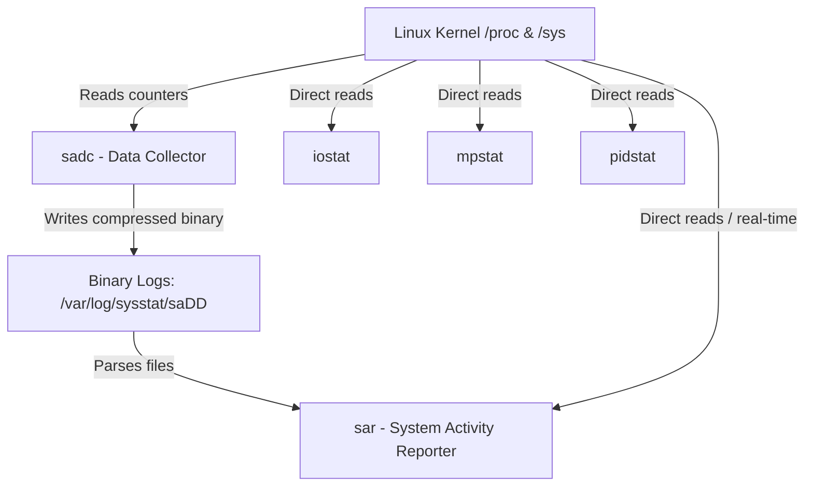

# SysStat — Historical Performance Analysis (sar, iostat, mpstat)

In Linux systems, understanding how system resources are being used is essential for maintaining performance, diagnosing problems, and planning capacity. A server or workstation may appear to be "slow," but without proper monitoring tools, it is difficult to know whether the cause is high CPU usage, memory pressure, disk bottlenecks, or network congestion.

As workloads increase, administrators and developers need a reliable way to answer questions such as:

- Is the CPU overloaded?
- Is disk I/O the bottleneck?
- Did memory pressure happen earlier in the day?
- Was the network interface saturated during peak hours?
- What changed between "the system was fine" and "the system became slow"?

**Sysstat** is designed to solve these problems. It is widely used by Linux administrators, DevOps engineers, SREs, backend engineers, and students learning operating systems or performance tuning. Instead of relying only on live tools such as `top` and `htop`, Sysstat provides a lightweight and standardized way to collect, record, and analyze historical resource usage data.

---

## 1. Core Concepts and Terminology

### 1.1 What is Sysstat?

Sysstat is a Linux performance monitoring package that collects and reports system resource usage—such as CPU, RAM, and I/O—as well as other system activities. Unlike `top` and `htop`, which only show the current state, Sysstat can record performance data over time, allowing administrators to analyze historical trends.

It includes several monitoring utilities:

- **`sar` (System Activity Reporter):** The core query tool. It displays real-time statistics or reads historical data from binary logs.
- **`iostat` (Input/Output Statistics):** Reports CPU statistics and input/output statistics for devices, partitions, and network filesystems.
- **`mpstat` (Multiprocessor Statistics):** Reports individual and average CPU utilization across multiple cores.
- **`pidstat` (Process ID Statistics):** Monitors resource consumption (CPU, memory, disk, tasks) for individual processes in real time.
- **`sadc` (System Activity Data Collector):** The background collector that reads system counters and saves them to binary log files.
- **`sa1` & `sa2`:** Wrapper scripts designed to be run from systemd or cron. `sa1` is a frontend to `sadc` for collecting data, and `sa2` is a frontend to `sar` for generating the daily summary.

### 1.2 Real-time vs. Historical Metrics

```
+---------------------------------------------------------------------------------+
|                                 Metric Types                                    |
+------------------------------------+--------------------------------------------+
| Real-time Metrics                  | Historical Metrics                         |
+------------------------------------+--------------------------------------------+
| * Instantly updated data points    | * Aggregated statistics collected over time|
| * Current operational state        | * Stored in intervals (e.g., every 10 min)  |
| * Excellent for active incidents   | * Excellent for post-mortem & capacity plans|
| * Example: Current disk write speed| * Example: RAM usage during a midnight cron|
+------------------------------------+--------------------------------------------+
```

---

## 2. Architecture: How Sysstat Works

Sysstat operates entirely by reading kernel performance counters exposed via the `/proc` and `/sys` virtual filesystems, then aggregating and formatting them to make them human-readable. **Sysstat does not implement any performance metric collection logic itself; it is a presentation and scheduling wrapper around raw kernel metrics.**



1. **Metric Exposure (Virtual Filesystems):** The Linux kernel maintains performance counters dynamically in memory and exposes them as text files in the `/proc` and `/sys` virtual filesystems. Sysstat tools parse these files:
    - **CPU Utilization:** Read from `/proc/stat` (CPU ticks spent in user, system, idle, iowait, etc.).
    - **Memory & Swap:** Read from `/proc/meminfo` (detailed RAM metrics) and `/proc/vmstat` (page/swap counters).
    - **Disk I/O:** Read from `/proc/diskstats` (sectors read/written, I/O time, etc.) and `/sys/block/` (device partition queues).
    - **Network Activity:** Read from `/proc/net/dev` (bytes/packets sent/received per interface).
    - **Process-level Resource Usage:** Read from `/proc/<PID>/stat` (CPU/memory), `/proc/<PID>/io` (disk reads/writes), and `/proc/<PID>/status` (FDs, threads).
    - **System Pressure (PSI):** Read from `/proc/pressure/cpu`, `/proc/pressure/io`, and `/proc/pressure/memory`.
2. **Collection (`sadc` via `sa1`):** The binary utility `sadc` (System Activity Data Collector) queries these files. It is not designed to be run directly by users; instead, it is wrapped by the `sa1` script which is triggered automatically.
3. **Scheduling (systemd or Cron):** A background scheduling system (like systemd timers or cron) executes the collection scripts periodically.
    - `sysstat-collect.timer` runs `sysstat-collect.service` (which calls `sa1`) every 10 minutes to write to `/var/log/sysstat/saDD` (where `DD` represents the day of the month).
    - `sysstat-summary.timer` runs `sysstat-summary.service` once a day (which calls `sa2`) to convert the binary log into a human-readable text file `/var/log/sysstat/sarDD`.
4. **Reporting (`sar`, `iostat`, `mpstat`, `pidstat`):** Users query the collected data. Tools like `iostat` and `mpstat` read `/proc` directly for instant real-time visualization, whereas `sar` can query either the live kernel or parse historical binary log archives using the `-f` flag.

---

## 3. Installation and Basic Configuration

### 3.1 Installation

Install Sysstat using your system's package manager:

**On Debian / Ubuntu / Linux Mint:**

```bash
sudo apt update
sudo apt install sysstat
```

**On RHEL / Rocky Linux / Fedora / AlmaLinux:**

```bash
sudo dnf install sysstat
```

### 3.2 Configuration (Debian/Ubuntu Specific)

By default, Debian-based distributions disable the background collection service to save a negligible amount of disk space and resource overhead.

The easiest and officially recommended way to enable it is via the package configuration tool:

```bash
sudo dpkg-reconfigure sysstat
```

*(Select "Yes" when prompted if sysstat should be enabled).*

Alternatively, you can manually edit the configuration file:

```bash
sudo nano /etc/default/sysstat
```

And change the `ENABLED` value from `false` to `true`:

```ini
# /etc/default/sysstat
ENABLED="true"
```

Finally, ensure the services are enabled and started:

```bash
sudo systemctl enable --now sysstat
sudo systemctl enable --now sysstat-collect.timer
sudo systemctl enable --now sysstat-summary.timer
```

### 3.3 Log Locations

- **Debian/Ubuntu:** `/var/log/sysstat/`

- **RHEL/CentOS/Fedora:** `/var/log/sa/`

Inside these folders, you will find files named:

- `saDD`: Binary data files (can only be read using `sar` or `sadf`).
- `sarDD`: Text-based summary reports generated daily.

### 3.4 Compiling and Running from Source (Local / No Installation)

If you don't want to install `sysstat` system-wide (or don't have root privileges), you can compile and run it directly within the source directory:

1. **Configure and Build:**

   ```bash
   ./configure
   make
   ```

2. **Run Standalone Tools Directly:**
   Standalone tools like `iostat`, `mpstat`, and `pidstat` can be run locally in this folder:

   ```bash
   ./iostat 1 5
   ./mpstat 1 5
   ./pidstat 1 5
   ```

3. **Run `sar` with PATH Override:**
   Under the hood, `sar` automatically runs the `sadc` collector tool. Because it's not installed on the system, `sar` will fail to find `sadc` at the default `/usr/local/lib/sa/sadc` path. You must prepend the current directory to your `PATH` environment variable so `sar` can find it locally:

   ```bash
   PATH=.:$PATH ./sar 1 5
   ```

4. **Test Mode (Virtual `/proc` Path Redirection):**
   In the source code, `/proc` and `/sys` path references are prefixed with a macro `PRE` defined in `systest.h`.
   - **Normal Compilation:** `PRE` is defined as `""` (empty string), so it reads live metrics directly from `/proc` and `/sys`.
   - **Unit Test Compilation (`#ifdef TEST`):** `PRE` is defined as `"./tests/root"`. This redirects all `/proc` and `/sys` reads to mock test files under `./tests/root/proc/...` and `./tests/root/sys/...` so the test suite can validate correct parsing logic.
5. **Local Background Scheduling (No `sudo` / User-level Cron):**
   If you want to automate periodic metric collection locally under your own user account without using `sudo` or modifying system-level directories:
   - Open your user-level crontab editor:

     ```bash
     crontab -e
     ```

   - Add a cron entry targeting the compiled `sadc` binary in your local build folder. Make sure to point the log output to a directory where your user has write permissions (e.g. your home directory) instead of the system-wide `/var/log/sa/`:

     ```cron
     # Run local sadc every 10 minutes to collect 1 sample and write to a local log file
     */10 * * * * /absolute/path/to/sysstat/sadc 1 1 /home/your_username/sysstat_local_data
     ```

   - You can inspect these locally-scheduled logs at any time using your local `sar` tool:

     ```bash
     ./sar -f /home/your_username/sysstat_local_data
     ```

---

## 4. Troubleshooting & Bottleneck Analysis Demonstration

This section demonstrates how to generate simulated CPU and Disk workloads, watch them in real-time, read them back historically, and isolate the performance bottleneck.

### 4.1 CPU-Bound Workload

To test CPU-bound performance, generate computational stress across multiple cores using `stress` or a `dd` processing loop.

#### 1. Generate Load

Generate CPU utilization across 4 cores for 60 seconds:

```bash
stress --cpu 4 --timeout 60
```

*(Alternatively, run `dd if=/dev/urandom of=/dev/null bs=1M count=1000` to stress a single thread).*

#### 2. Watch Real-time with `mpstat`

Run `mpstat` to examine individual processor cores every 1 second, 5 times:

```bash
mpstat -P ALL 1 5
```

**Simulated Output:**

```
Linux 6.1.0-22-amd64 (debian)    07/10/26        _x86_64_        (4 CPU)

10:15:01 PM  CPU    %usr   %nice    %sys %iowait    %steal   %irq   %soft  %guest  %gnice   %idle
10:15:02 PM  all   98.50    0.00    1.50    0.00      0.00   0.00   0.00    0.00    0.00    0.00
10:15:02 PM    0   99.00    0.00    1.00    0.00      0.00   0.00   0.00    0.00    0.00    0.00
10:15:02 PM    1   98.00    0.00    2.00    0.00      0.00   0.00   0.00    0.00    0.00    0.00
10:15:02 PM    2   99.00    0.00    1.00    0.00      0.00   0.00   0.00    0.00    0.00    0.00
10:15:02 PM    3   98.00    0.00    2.00    0.00      0.00   0.00   0.00    0.00    0.00    0.00
```

- **Analysis:** `%usr` is sitting near 100% across all cores while `%idle` is 0.00%. Because `%iowait` is 0.00%, the CPU is busy doing actual computational work (user-space operations), not waiting for disks.

---

### 4.2 Disk I/O-Bound Workload

To test disk performance, generate heavy write disk operations using direct file writing.

#### 1. Generate Load

Write 4 GB of zeros directly to disk bypassing the OS page cache:

```bash
dd if=/dev/zero of=testfile bs=1M count=4096 oflag=direct
```

#### 2. Watch Real-time with `iostat`

Run `iostat` with extended, human-readable disk statistics every 1 second, 5 times (filtering out unused loopback devices using `-z`):

```bash
iostat -xz 1 5
```

**Simulated Output:**

```
Device            r/s     w/s     kB_r/s     kB_w/s   r_await w_await aqu-sz svctm  %util
sda              0.00  850.00       0.00  108800.00      0.00   15.40   3.20  1.10  93.50
```

- **Analysis:**
  - `w/s`: The disk is performing 850 write operations per second.
  - `kB_w/s`: Write throughput is ~106 MB/s.
  - `w_await`: Average write request wait time is 15.40 milliseconds. In storage troubleshooting, any `await` value consistently exceeding 10-15ms indicates congestion.
  - `%util`: The disk device was busy performing I/O for 93.50% of the monitoring window.

---

### 4.3 Reading Back Historical Data with `sar`

If you generated the loads earlier in the day, the background `sadc` daemon logged those events.

#### 1. Extract CPU History

Read CPU utilization metrics from the active or past daily log file (assuming today is the 10th):

```bash
sar -u -f /var/log/sysstat/sa10
```

**Simulated Output:**

```
10:10:01 PM       CPU     %user     %nice   %system   %iowait    %steal     %idle
10:20:01 PM       all      1.20      0.00      0.45      0.10      0.00     98.25
10:30:01 PM       all     42.50      0.00      2.10     18.50      0.00     36.90
10:40:01 PM       all      0.80      0.00      0.30      0.05      0.00     98.85
```

- **Analysis:** A significant resource anomaly occurred between 10:20 PM and 10:30 PM, where `%user` rose to 42.50% and `%iowait` spiked to 18.50%.

#### 2. Extract Disk History

Cross-reference the CPU anomaly by checking the disk performance during that same window:

```bash
sar -d -f /var/log/sysstat/sa10
```

**Simulated Output:**

```
10:20:01 PM       DEV       tps     rkB/s     wkB/s   areq-sz  aqu-sz  await  %util
10:30:01 PM    dev8-0    890.00      0.00 110200.00    124.00    4.50  19.20  98.10
```

- **Isolating the Bottleneck:** During the 10:30 PM poll:
  - `%iowait` on the CPU was high (18.50%).
  - `%util` on disk device `dev8-0` (major/minor number matching `sda`) was pinned at 98.10%.
  - Disk latency (`await`) rose to 19.20ms.
  - **Conclusion:** The bottleneck was **Disk I/O**. The CPU was not slow; it sat idle waiting for the storage drive to write 110 MB/s of data.

---

## 5. Bonus: Advanced Scheduled Collection (sadc & cron)

By default, Sysstat collects data every 10 minutes. For high-resolution troubleshooting, you can configure it to capture metrics at a higher frequency.

### 5.1 Configuring 1-Minute Metrics via systemd

Modern Linux distributions use systemd timers rather than cron to drive Sysstat.

1. Edit the systemd timer configuration override:

    ```bash
    sudo systemctl edit sysstat-collect.timer
    ```

2. Add the following lines to change the frequency to every 1 minute:

    ```ini
    [Timer]
    OnCalendar=
    OnCalendar=*:0/1
    ```

3. Reload systemd and restart the timer:

    ```bash
    sudo systemctl daemon-reload
    sudo systemctl restart sysstat-collect.timer
    ```

### 5.2 Configuring via Cron (Alternative)

On older systems using cron (e.g., RHEL 6/7, older Debian), edit `/etc/cron.d/sysstat`:

```cron
# Run system activity collector every 1 minute
*/1 * * * * root /usr/lib64/sa/sa1 /usr/lib64/sa/sa2 -A
```

### 5.3 Exporting for Long-Term Trend Analysis

Because Sysstat logs are binary files, they can be exported to standard JSON or CSV files using `sadf`. This is useful for importing logs into spreadsheet programs or feeding them into database archives.

- **Export to CSV:**

    ```bash
    sadf -d /var/log/sysstat/sa10 -- -u > cpu_report.csv
    ```

- **Export to JSON:**

    ```bash
    sadf -j /var/log/sysstat/sa10 -- -d > disk_report.json
    ```

---

## 6. Real-Time Alternatives Comparison

Sysstat provides unique advantages over live command-line tools and complex cloud monitoring frameworks:

```
+---------------------------------------------------------------------------------------------------+
|                                  Tool Comparison Matrix                                           |
+----------------------+--------------------+---------------------+---------------------------------+
| Tool / Stack         | Monitoring Horizon | Overhead            | Best Used For                   |
+----------------------+--------------------+---------------------+---------------------------------+
| top / htop / btop    | Real-Time Only     | Low                 | Fast interactive troubleshooting|
| vmstat / dstat       | Real-Time Only     | Very Low            | Raw kernel metric monitoring    |
| sysstat (sar)        | Real-Time & Hist.  | Low (Binary Logs)   | Post-mortem & historical audits |
| atop                 | Real-Time & Hist.  | Moderate            | Retrospective process tracing   |
| Netdata / Glances    | Real-Time & Hist.  | Moderate-High (Web) | Lightweight local web dashboards|
| Prometheus + Grafana | Enterprise Hist.   | High (Infrastructure)| Scalable cloud deployments     |
+----------------------+--------------------+---------------------+---------------------------------+
```

- **`top` / `htop` / `btop`:** Great for showing what is happening *right now* and interactive process management (such as sorting by memory or sending `SIGKILL` directly). However, they cannot answer what occurred at 3:00 AM.
- **`atop`:** Similar to sysstat but also logs active process histories. If a process spikes the CPU for 10 seconds at midnight and exits, `atop` records its name; `sar` will only record a brief bump in overall CPU utilization.
- **Prometheus + Grafana:** The enterprise gold standard. It scrapes metrics over the network and plots them in interactive dashboards. However, it requires a time-series database, node exporters, and graphical servers, whereas Sysstat works completely out-of-the-box on a standalone server with no external dependencies.

---

## 7. Benefits and Limitations

### 7.1 Benefits

- **Resource efficiency:** Uses negligible CPU and writes tiny compressed binary log files (often less than a few megabytes per day).

- **Standalone operation:** No network connection, database, web daemon, or external server agents are required.
- **Decoupled analysis:** You can copy a binary `/var/log/sysstat/saDD` file from a remote client production machine and analyze it locally using `sar -f` on your workspace.

### 7.2 Limitations

- **No native UI:** Output is purely text-based (CLI tables).

- **Default granularity:** 10-minute intervals can miss micro-bursts of resource usage.
- **Architecture dependency:** Binary logs generated on a 32-bit ARM machine cannot be read directly on a 64-bit x86 machine. They must be exported to text/JSON first using `sadf`.
- **Lack of process persistence:** Unlike `atop`, standard `sar` records system-wide statistics rather than which specific process name caused a resource spike.

---

## 8. Common Mistakes and Misunderstandings

### 8.1 The "First Line Anomaly" Trap
>
> [!WARNING]
> Running commands like `iostat 2` or `vmstat 1` and immediately panicking because the first line of output shows massive, alarming resource usage is a common mistake.
>
> **The Reality:** For almost all sysstat utilities, the very first line of output displays the **average statistics accumulated since the system was booted**. Only the subsequent lines show the actual real-time activity during the specified monitoring interval. Always ignore the first line of data.

### 8.2 The Modern Storage Delusion (NVMe vs. `%util`)
>
> [!NOTE]
> Seeing `%util` (disk utilization) at 100% in `iostat -x` and concluding that the storage drive is completely saturated and failing to keep up is incorrect on modern drives.
>
> **The Reality:** The `%util` metric was designed decades ago for old, spinning hard drives (HDDs) that could only handle one read/write request at a time. Modern NVMe SSDs and enterprise cloud arrays can handle tens of thousands of parallel queues simultaneously. A 100% `%util` just means the drive was busy doing *at least one* I/O operation during that entire second, but it might still have 90% of its parallel queue depth and bandwidth completely free.

### 8.3 The Debian/Ubuntu "It Doesn't Work Out of the Box" Trap
>
> [!IMPORTANT]
> Installing Sysstat (`apt install sysstat`), immediately typing `sar`, and getting the error: `Cannot open /var/log/sysstat/saXX: No such file or directory` is because historical tracking is turned off by default.
>
> **The Reality:** On Debian/Ubuntu and their derivatives, automated background data collection is explicitly disabled by default. You must enable it by running `sudo dpkg-reconfigure sysstat` and selecting "Yes" (or editing `/etc/default/sysstat` manually), then start the systemd timer: `sudo systemctl enable --now sysstat-collect.timer`.

### 8.4 Trying to Read History Logs with `cat`, `less`, or `nano`
>
> [!CAUTION]
> Navigating to `/var/log/sysstat/` and typing `cat sa09` to see what caused a server crash on the 9th day of the month will print unreadable binary gibberish to your screen.
>
> **The Reality:** Sysstat saves raw data in a highly compressed binary format to keep the storage footprint minimal. To read these files, you must pass them back into the `sar` utility using the `-f` flag (e.g., `sar -f /var/log/sysstat/sa09`), or use `sadf` to format them.

### 8.5 Inverting Interval and Count Syntax
>
> [!WARNING]
> If you want to monitor CPU performance every second for 5 seconds, running `sar 5 1` will not give you the desired result.
>
> **The Reality:** The syntax across the entire Sysstat suite is strictly `command [interval] [count]`.
>
> - `sar 1 5` means: Check every 1 second, 5 times total (Takes 5 seconds, prints 5 updates).
> - `sar 5 1` means: Wait 5 seconds, check exactly 1 time, and stop (Takes 5 seconds, prints 1 update).

### 8.6 Misinterpreting `%iowait` as CPU Weakness
>
> [!NOTE]
> Seeing a high `%iowait` percentage in `sar` or `mpstat` and assuming the CPU is weak or overloaded is a common misdiagnosis.
>
> **The Reality:** `%iowait` is actually a sub-category of CPU **Idle** time. It means the CPU is sitting completely idle with absolutely nothing to do because it is waiting for a storage device or network share to finish sending it data. High `%iowait` indicates a storage performance bottleneck, slow disk array, or missing database indexing—not an underpowered CPU.

### 8.7 Confusing High "Load Average" with High CPU Usage
>
> [!IMPORTANT]
> Running `sar -q` or `uptime`, seeing a high Load Average (e.g., 20.0 on a 4-core CPU), and assuming the CPU is running out of calculation capacity is incorrect.
>
> **The Reality:** On Linux, the Load Average includes both processes actively using the CPU and processes stuck in "Uninterruptible Sleep" (usually waiting for Disk I/O or network responses). A server can have a massive load average of 50 while the CPU usage sits at a comfortable 2% if a network storage mount drops offline and dozens of processes get stuck waiting for it.

---

## 9. Conclusion

Sysstat acts as the lightweight "flight data recorder" for Linux servers. While modern visualization platforms like Prometheus and Grafana provide real-time dashboards for complex cluster architectures, Sysstat remains the most reliable, zero-overhead, and offline-compatible choice for single-server health audits, capacity baseline creation, and forensic post-mortem analysis. By mastering `sar`, `mpstat`, and `iostat`, developers and system administrators can quickly determine if a performance slowdown is due to CPU constraints or disk storage bottlenecks.
